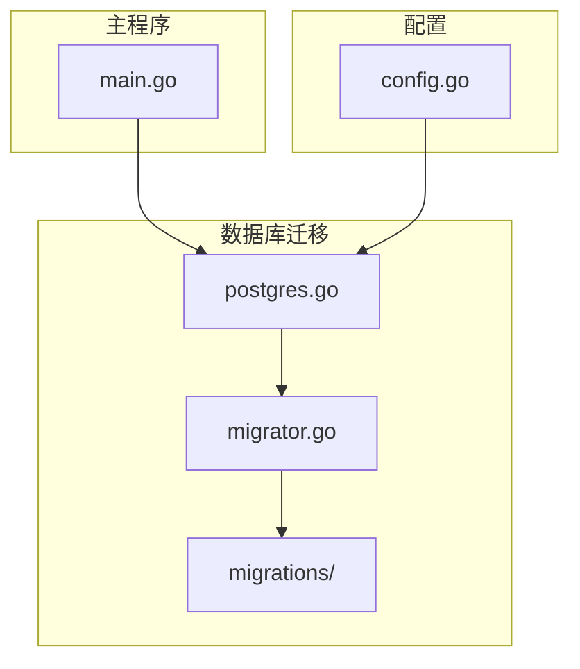
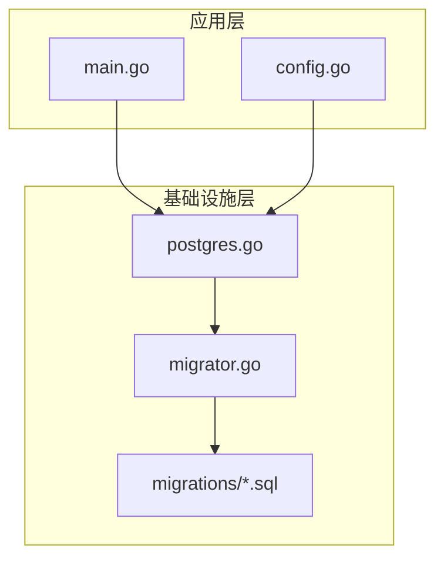
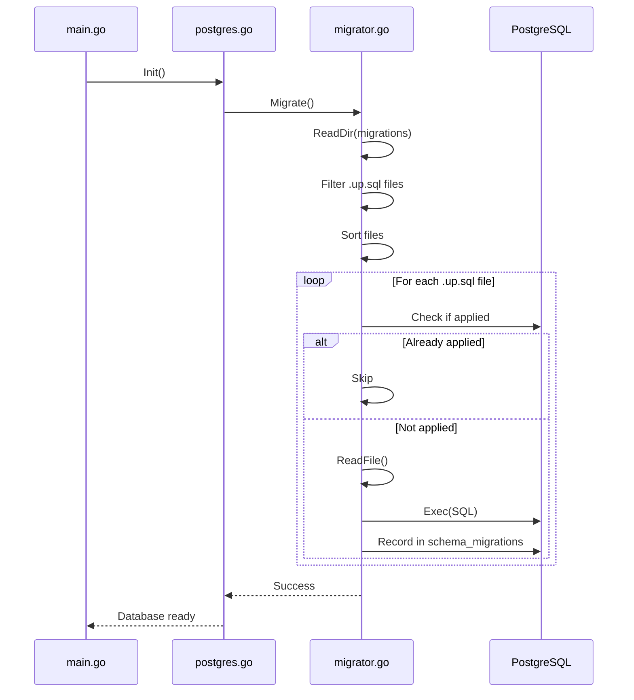
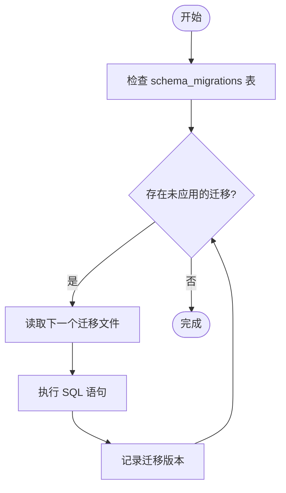
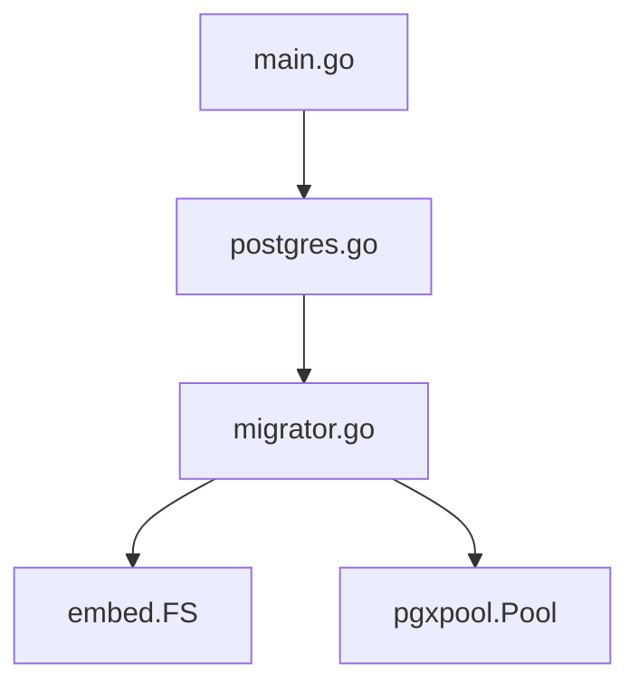

# 数据库迁移

<cite>
**本文档引用的文件**  
- [Makefile](file://Makefile)
- [migrator.go](file://internal/infrastructure/db/migrator.go)
- [postgres.go](file://internal/infrastructure/db/postgres.go)
- [migrations/](file://internal/infrastructure/db/migrations/)
- [001_init_schema.up.sql](file://internal/infrastructure/db/migrations/001_init_schema.up.sql)
- [001_init_schema.down.sql](file://internal/infrastructure/db/migrations/001_init_schema.down.sql)
- [tdd/04_storage.md](file://docs/tdd/04_storage.md)
- [config.go](file://internal/pkg/config/config.go)
</cite>

## 目录
1. [简介](#简介)
2. [项目结构](#项目结构)
3. [核心组件](#核心组件)
4. [架构概述](#架构概述)
5. [详细组件分析](#详细组件分析)
6. [依赖分析](#依赖分析)
7. [性能考虑](#性能考虑)
8. [故障排除指南](#故障排除指南)
9. [结论](#结论)
10. [附录](#附录)（如有必要）

## 简介
本文档旨在为《The Council》项目提供全面的数据库迁移操作指南。文档详细说明了如何通过Makefile提供的命令安全地执行数据库模式变更，包括迁移脚本的存放位置、命名规范以及编写向后兼容的迁移脚本的最佳实践。同时，文档还涵盖了生产环境中的备份策略和回滚预案，解释了迁移工具如何与PostgreSQL数据库交互以确保数据完整性，并结合TDD存储设计文档阐明数据库变更对系统整体架构的影响。

## 项目结构
项目采用分层架构设计，其中数据库迁移相关的文件位于`internal/infrastructure/db/migrations/`目录下。该目录包含了所有版本化的SQL迁移脚本，每个脚本都遵循特定的命名规范，以便于管理和追踪数据库模式的演变过程。

**Diagram sources**
- [migrator.go](file://internal/infrastructure/db/migrator.go#L1-L108)
- [postgres.go](file://internal/infrastructure/db/postgres.go#L1-L65)
- [main.go](file://cmd/council/main.go#L1-L149)

**Section sources**
- [Makefile](file://Makefile#L1-L374)
- [migrator.go](file://internal/infrastructure/db/migrator.go#L1-L108)

## 核心组件
数据库迁移的核心组件包括`migrator.go`中的`Migrate`函数，它负责读取并执行嵌入式SQL迁移脚本。这些脚本被嵌入到二进制文件中，确保了迁移的一致性和可移植性。此外，`postgres.go`中的`Init`函数在应用启动时初始化数据库连接池，并调用`Migrate`函数来应用任何未执行的迁移。

**Section sources**
- [migrator.go](file://internal/infrastructure/db/migrator.go#L19-L108)
- [postgres.go](file://internal/infrastructure/db/postgres.go#L18-L49)

## 架构概述
系统的数据库迁移架构基于Go语言的`embed`包实现，将SQL迁移脚本直接嵌入到编译后的二进制文件中。这种设计简化了部署流程，避免了外部依赖，同时也保证了迁移脚本的版本控制与代码库同步。迁移工具通过检查`schema_migrations`表来确定哪些迁移尚未应用，并按顺序执行它们。

**Diagram sources**
- [migrator.go](file://internal/infrastructure/db/migrator.go#L14-L15)
- [postgres.go](file://internal/infrastructure/db/postgres.go#L18-L49)

## 详细组件分析

### 迁移器分析
`Migrate`函数是数据库迁移的核心逻辑所在。它首先读取`migrations`目录下的所有`.up.sql`文件，并按照文件名排序。然后，对于每一个未应用的迁移，它会读取SQL内容并在数据库中执行。执行成功后，迁移的版本号会被记录在`schema_migrations`表中，防止重复执行。

#### 对于API/服务组件：

**Diagram sources**
- [migrator.go](file://internal/infrastructure/db/migrator.go#L19-L108)
- [postgres.go](file://internal/infrastructure/db/postgres.go#L46-L48)

**Section sources**
- [migrator.go](file://internal/infrastructure/db/migrator.go#L19-L108)
- [postgres.go](file://internal/infrastructure/db/postgres.go#L18-L49)

### 概念概述
数据库迁移是一种版本控制系统，用于管理数据库模式的变化。每次对数据库结构进行更改（如添加新表、修改列类型等）时，都需要创建一个新的迁移脚本。这些脚本按顺序执行，确保数据库状态的一致性。

[无来源，因为此图表显示的是概念性工作流，而非实际代码结构]

[无来源，因为此部分不分析特定文件]

## 依赖分析
数据库迁移机制依赖于多个组件之间的协作。`main.go`作为入口点，调用`postgres.Init`来初始化数据库连接。`postgres.Init`进一步调用`migrator.Migrate`来执行迁移。`migrator.Migrate`则依赖于`embed.FS`来访问嵌入的迁移文件，并使用`pgxpool.Pool`来执行SQL语句。

**Diagram sources**
- [main.go](file://cmd/council/main.go#L32-L36)
- [postgres.go](file://internal/infrastructure/db/postgres.go#L18-L49)
- [migrator.go](file://internal/infrastructure/db/migrator.go#L19-L108)

**Section sources**
- [main.go](file://cmd/council/main.go#L32-L36)
- [postgres.go](file://internal/infrastructure/db/postgres.go#L18-L49)
- [migrator.go](file://internal/infrastructure/db/migrator.go#L19-L108)

## 性能考虑
由于迁移脚本是在应用启动时同步执行的，因此应尽量减少单个迁移的执行时间。建议将大型迁移拆分为多个小的、独立的迁移，以降低锁定数据库的时间。此外，应在非高峰时段执行迁移，以减少对用户的影响。

[无来源，因为此部分提供一般性指导]

## 故障排除指南
当迁移失败时，首先检查数据库日志以获取详细的错误信息。常见的问题包括SQL语法错误、约束冲突或权限不足。如果迁移部分成功但中途失败，可能需要手动清理数据库状态，然后重新运行迁移。在生产环境中，建议在执行迁移前备份数据库。

**Section sources**
- [migrator.go](file://internal/infrastructure/db/migrator.go#L68-L94)
- [postgres_test.go](file://internal/infrastructure/db/postgres_test.go#L8-L12)

## 结论
本文档详细介绍了《The Council》项目的数据库迁移机制，从核心组件到架构设计，再到具体的实施步骤和最佳实践。通过遵循本文档的指导，开发人员可以安全、高效地管理数据库模式的变更，确保系统的稳定性和数据的完整性。

[无来源，因为此部分总结而不分析特定文件]