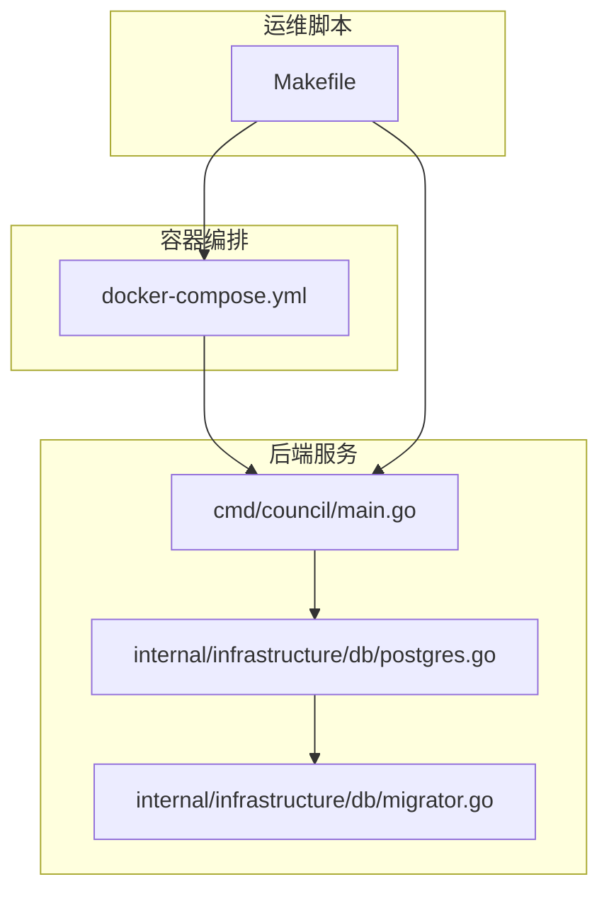
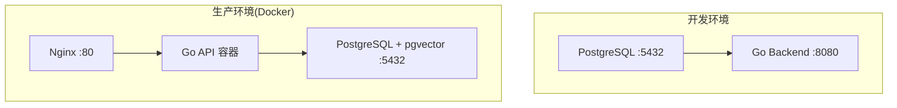
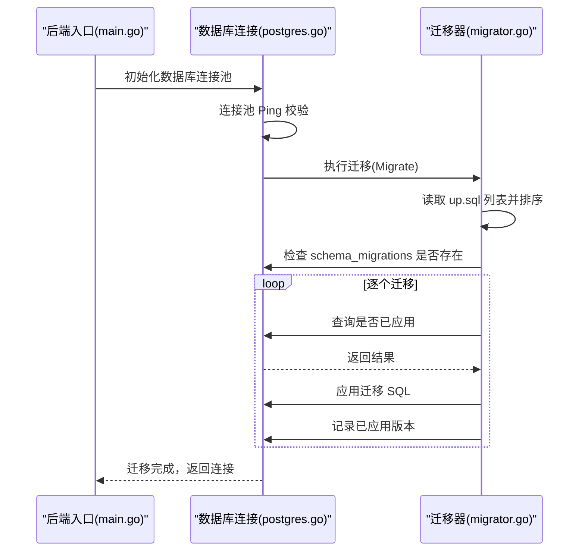
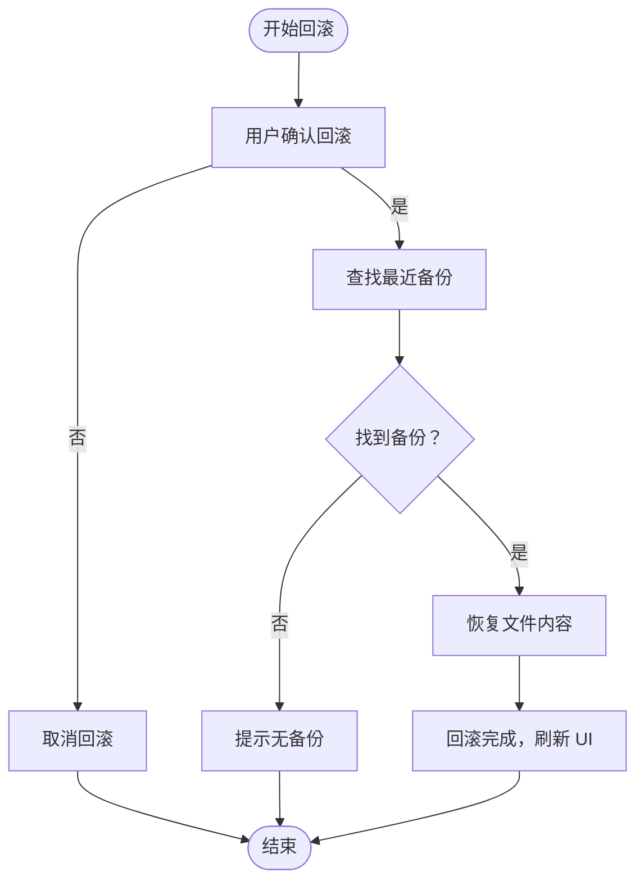
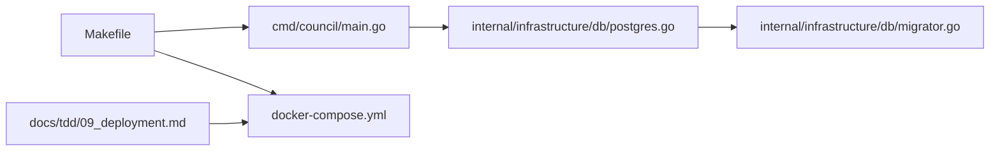

# 监控与维护

<cite>
**本文引用的文件**
- [docker-compose.yml](file://docker-compose.yml)
- [Makefile](file://Makefile)
- [cmd/council/main.go](file://cmd/council/main.go)
- [internal/infrastructure/db/postgres.go](file://internal/infrastructure/db/postgres.go)
- [internal/infrastructure/db/migrator.go](file://internal/infrastructure/db/migrator.go)
- [docs/tdd/09_deployment.md](file://docs/tdd/09_deployment.md)
- [README.md](file://README.md)
- [internal/core/middleware/versioning.go](file://internal/core/middleware/versioning.go)
- [docs/specs/sprint5/SPEC-504-security-hardening.md](file://docs/specs/sprint5/SPEC-504-security-hardening.md)
</cite>

## 目录
1. [简介](#简介)
2. [项目结构](#项目结构)
3. [核心组件](#核心组件)
4. [架构总览](#架构总览)
5. [详细组件分析](#详细组件分析)
6. [依赖关系分析](#依赖关系分析)
7. [性能与可靠性考量](#性能与可靠性考量)
8. [故障排查指南](#故障排查指南)
9. [结论](#结论)
10. [附录](#附录)

## 简介
本文件面向生产环境运维与维护，围绕服务健康检查、日志管理、数据库迁移与系统更新给出最佳实践。重点覆盖以下方面：
- 如何利用 Docker Compose 的 healthcheck 监控 PostgreSQL 可用性
- 如何使用 docker-compose logs 实时查看 API 后端日志
- 如何通过 Makefile 或 docker-compose exec 执行数据库迁移（up）
- 服务更新、回滚与备份恢复的操作指南
- 建议引入外部监控工具（如 Prometheus、Grafana）以持续跟踪系统性能

## 项目结构
该仓库采用多层架构与分层模块化组织，后端入口在 cmd/council/main.go，数据库连接与迁移位于 internal/infrastructure/db，Docker Compose 用于本地与生产容器编排，Makefile 提供常用运维命令。

图表来源
- [docker-compose.yml](file://docker-compose.yml#L1-L24)
- [cmd/council/main.go](file://cmd/council/main.go#L1-L150)
- [internal/infrastructure/db/postgres.go](file://internal/infrastructure/db/postgres.go#L1-L66)
- [internal/infrastructure/db/migrator.go](file://internal/infrastructure/db/migrator.go#L1-L109)
- [Makefile](file://Makefile#L1-L374)

章节来源
- [docker-compose.yml](file://docker-compose.yml#L1-L24)
- [Makefile](file://Makefile#L1-L374)
- [cmd/council/main.go](file://cmd/council/main.go#L1-L150)
- [internal/infrastructure/db/postgres.go](file://internal/infrastructure/db/postgres.go#L1-L66)
- [internal/infrastructure/db/migrator.go](file://internal/infrastructure/db/migrator.go#L1-L109)

## 核心组件
- Docker Compose 编排与健康检查：本地开发与生产部署均通过 docker-compose.yml 管理服务生命周期与健康检查策略。
- 后端启动与数据库初始化：后端入口在 cmd/council/main.go，启动时初始化数据库连接池并自动执行迁移。
- 数据库迁移：迁移器在 internal/infrastructure/db/migrator.go 中实现，按顺序执行 up.sql 并记录已应用版本。
- 运维命令：Makefile 提供 start/stop/status/logs-db/reset-db 等常用命令；同时包含数据库迁移相关目标（见附录）。

章节来源
- [docker-compose.yml](file://docker-compose.yml#L1-L24)
- [cmd/council/main.go](file://cmd/council/main.go#L1-L150)
- [internal/infrastructure/db/postgres.go](file://internal/infrastructure/db/postgres.go#L1-L66)
- [internal/infrastructure/db/migrator.go](file://internal/infrastructure/db/migrator.go#L1-L109)
- [Makefile](file://Makefile#L1-L374)

## 架构总览
下图展示生产环境典型部署形态与健康检查、日志采集、迁移与更新的关键路径。

图表来源
- [docs/tdd/09_deployment.md](file://docs/tdd/09_deployment.md#L1-L74)

章节来源
- [docs/tdd/09_deployment.md](file://docs/tdd/09_deployment.md#L1-L74)

## 详细组件分析

### 服务健康检查（PostgreSQL）
- 在生产部署文档中，PostgreSQL 服务配置了 healthcheck，使用 pg_isready 检测数据库可用性，具备间隔、超时与重试参数，确保依赖服务健康后再启动后端。
- 本地 docker-compose.yml 未包含 healthcheck 字段，建议在生产环境使用部署文档中的配置。

最佳实践要点
- 使用 healthcheck 确保后端只在数据库健康时启动
- 结合 depends_on: condition: service_healthy 控制启动顺序
- 在容器编排中为数据库设置持久卷，避免重启导致数据丢失

章节来源
- [docs/tdd/09_deployment.md](file://docs/tdd/09_deployment.md#L25-L72)
- [docker-compose.yml](file://docker-compose.yml#L1-L24)

### 日志管理与实时查看
- 后端日志：后端启动时输出关键信息，包括数据库连接建立与迁移执行结果。生产环境可通过 docker-compose logs 实时查看后端日志。
- 数据库日志：Makefile 提供 logs-db 目标，可跟随查看数据库容器日志。

运维建议
- 使用 docker-compose logs -f 实时查看后端日志，结合时间戳定位问题
- 对于文件日志，建议在生产环境统一收集至集中式日志系统（如 ELK/Fluentd/Loki），便于检索与告警
- 后端日志应包含请求上下文（如会话 ID、请求 ID）以便关联追踪

章节来源
- [cmd/council/main.go](file://cmd/council/main.go#L1-L150)
- [Makefile](file://Makefile#L84-L94)
- [docker-compose.yml](file://docker-compose.yml#L1-L24)

### 数据库迁移（migrate up/down）
- 后端启动时会自动执行迁移，迁移器按顺序读取 migrations/*.up.sql 并记录已应用版本，避免重复执行。
- 生产环境可通过 docker-compose exec 进入后端容器执行迁移命令（参考部署文档中的示例）。
- 本地开发可通过 Makefile 的数据库相关目标进行快速验证（reset-db、logs-db 等）。

迁移流程（启动时自动执行）

图表来源
- [cmd/council/main.go](file://cmd/council/main.go#L1-L150)
- [internal/infrastructure/db/postgres.go](file://internal/infrastructure/db/postgres.go#L1-L66)
- [internal/infrastructure/db/migrator.go](file://internal/infrastructure/db/migrator.go#L1-L109)

章节来源
- [internal/infrastructure/db/migrator.go](file://internal/infrastructure/db/migrator.go#L1-L109)
- [internal/infrastructure/db/postgres.go](file://internal/infrastructure/db/postgres.go#L1-L66)
- [docs/tdd/09_deployment.md](file://docs/tdd/09_deployment.md#L166-L178)
- [Makefile](file://Makefile#L84-L94)

### 服务更新、回滚与备份恢复
- 版本化中间件：提供文件备份与回滚能力，支持查找最新备份、恢复文件内容等。
- 回滚交互：在人类评审节点中，用户可选择回滚至上一版本，系统读取最近备份并覆盖目标文件，随后回到上一轮循环。
- 备份目录：备份文件按会话 ID 分类存储，文件名包含时间戳，便于识别与清理。

回滚流程（概念示意）

章节来源
- [internal/core/middleware/versioning.go](file://internal/core/middleware/versioning.go#L99-L155)
- [docs/specs/sprint5/SPEC-504-security-hardening.md](file://docs/specs/sprint5/SPEC-504-security-hardening.md#L168-L222)

### 外部监控与指标（Prometheus、Grafana）
- 建议在生产环境中集成 Prometheus 抓取后端指标（如 HTTP 请求延迟、错误率、内存与 GC 指标），并使用 Grafana 可视化。
- 可将数据库连接池状态、Redis 缓存命中率、LLM 调用耗时等纳入监控面板，结合告警规则实现自动化处置。
- 日志层面建议接入集中式日志系统，结合 Loki/Promtail 实现日志查询与告警。

[本节为通用运维建议，不直接分析具体源码文件]

## 依赖关系分析
- 后端入口依赖数据库初始化与迁移器；数据库初始化依赖连接池与健康检查；迁移器依赖嵌入式 SQL 文件与 schema_migrations 记录。
- Makefile 与 docker-compose.yml 共同支撑服务生命周期管理与日志查看；部署文档提供生产环境健康检查与迁移执行示例。

图表来源
- [cmd/council/main.go](file://cmd/council/main.go#L1-L150)
- [internal/infrastructure/db/postgres.go](file://internal/infrastructure/db/postgres.go#L1-L66)
- [internal/infrastructure/db/migrator.go](file://internal/infrastructure/db/migrator.go#L1-L109)
- [Makefile](file://Makefile#L1-L374)
- [docker-compose.yml](file://docker-compose.yml#L1-L24)
- [docs/tdd/09_deployment.md](file://docs/tdd/09_deployment.md#L1-L74)

章节来源
- [cmd/council/main.go](file://cmd/council/main.go#L1-L150)
- [internal/infrastructure/db/postgres.go](file://internal/infrastructure/db/postgres.go#L1-L66)
- [internal/infrastructure/db/migrator.go](file://internal/infrastructure/db/migrator.go#L1-L109)
- [Makefile](file://Makefile#L1-L374)
- [docker-compose.yml](file://docker-compose.yml#L1-L24)
- [docs/tdd/09_deployment.md](file://docs/tdd/09_deployment.md#L1-L74)

## 性能与可靠性考量
- 数据库连接池：合理配置最大连接数与空闲连接，避免在高并发场景出现连接不足或过度占用。
- 迁移幂等：迁移器已记录已应用版本，避免重复执行；建议在变更 SQL 中加入 IF NOT EXISTS 等保护。
- 健康检查：生产环境启用 healthcheck 并设置合理的间隔与重试次数，确保依赖服务稳定。
- 日志分级：区分 INFO/WARN/ERROR 级别，避免过量日志影响性能；对敏感字段进行脱敏处理。
- 回滚保障：回滚前进行备份，回滚后校验文件一致性与业务流程正确性。

[本节为通用指导，不直接分析具体源码文件]

## 故障排查指南
- 数据库不可用
  - 检查 PostgreSQL 健康状态与日志：docker-compose logs -f db
  - 确认 healthcheck 配置与依赖服务启动顺序
- 后端无法启动
  - 查看后端日志：docker-compose logs -f backend
  - 检查数据库连接字符串与网络连通性
- 迁移失败
  - 查看迁移器日志与错误信息，确认 schema_migrations 表是否存在
  - 逐步回放 up.sql，定位具体语句错误
- 回滚异常
  - 确认备份文件是否存在且可读
  - 检查目标文件写权限与磁盘空间

章节来源
- [Makefile](file://Makefile#L84-L94)
- [docs/tdd/09_deployment.md](file://docs/tdd/09_deployment.md#L166-L178)
- [internal/infrastructure/db/migrator.go](file://internal/infrastructure/db/migrator.go#L1-L109)
- [internal/core/middleware/versioning.go](file://internal/core/middleware/versioning.go#L99-L155)

## 结论
通过 Docker Compose 的健康检查、集中日志与自动迁移机制，结合版本化中间件提供的回滚能力，可在生产环境中实现稳定可靠的运维闭环。建议进一步引入 Prometheus/Grafana 等外部监控体系，完善指标采集与可视化，提升系统可观测性与可维护性。

[本节为总结性内容，不直接分析具体源码文件]

## 附录

### A. 健康检查与日志查看
- 健康检查：生产环境建议在 docker-compose.yml 中为数据库添加 healthcheck，参考部署文档示例。
- 日志查看：使用 docker-compose logs -f 实时查看后端日志；Makefile 提供 logs-db 目标查看数据库日志。

章节来源
- [docs/tdd/09_deployment.md](file://docs/tdd/09_deployment.md#L25-L72)
- [Makefile](file://Makefile#L84-L94)

### B. 数据库迁移（Makefile 与 docker-compose exec）
- Makefile：提供 start-db、stop-db、logs-db、reset-db 等常用目标，便于本地验证。
- docker-compose exec：生产环境可进入后端容器执行迁移命令，参考部署文档示例。

章节来源
- [Makefile](file://Makefile#L71-L94)
- [docs/tdd/09_deployment.md](file://docs/tdd/09_deployment.md#L166-L178)

### C. 服务更新与回滚
- 更新流程：构建新镜像并替换容器，确保数据库健康检查通过后再启动后端。
- 回滚流程：在人类评审节点中选择回滚，系统读取最近备份并覆盖目标文件，随后回到上一轮循环。

章节来源
- [internal/core/middleware/versioning.go](file://internal/core/middleware/versioning.go#L99-L155)
- [docs/specs/sprint5/SPEC-504-security-hardening.md](file://docs/specs/sprint5/SPEC-504-security-hardening.md#L168-L222)

### D. 安全与审计日志
- 敏感字段脱敏：建议对日志中的敏感字段进行脱敏处理，避免泄露。
- 审计日志：记录关键操作事件，便于事后追溯与合规审计。

章节来源
- [docs/specs/sprint5/SPEC-504-security-hardening.md](file://docs/specs/sprint5/SPEC-504-security-hardening.md#L168-L222)