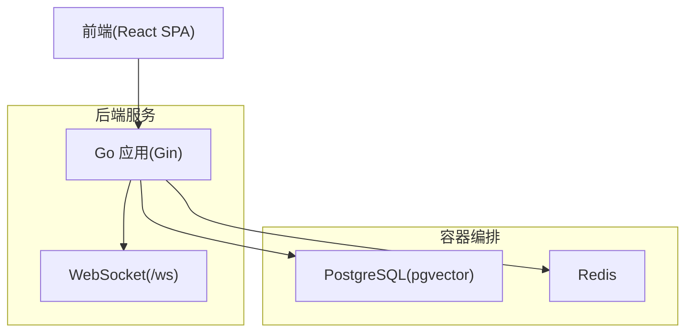
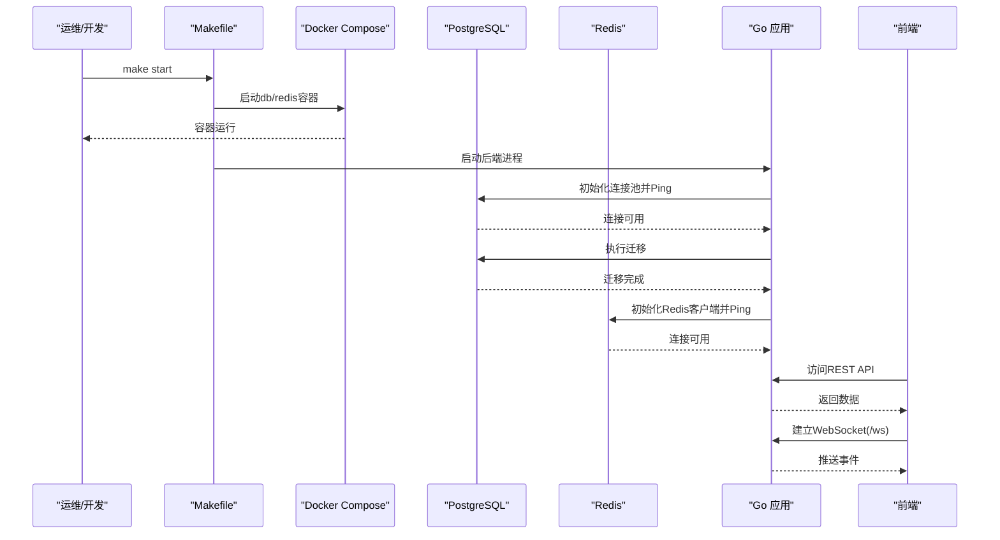
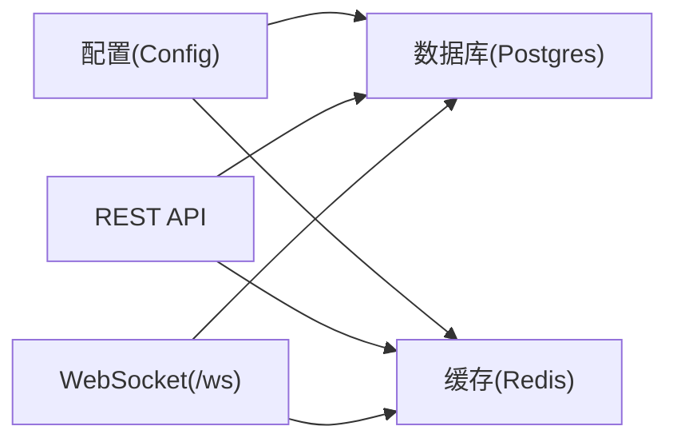

# 监控与维护

<cite>
**本文引用的文件**
- [docker-compose.yml](file://docker-compose.yml)
- [Makefile](file://Makefile)
- [README.md](file://README.md)
- [cmd/council/main.go](file://cmd/council/main.go)
- [internal/infrastructure/db/postgres.go](file://internal/infrastructure/db/postgres.go)
- [internal/infrastructure/db/migrator.go](file://internal/infrastructure/db/migrator.go)
- [internal/infrastructure/cache/redis.go](file://internal/infrastructure/cache/redis.go)
- [internal/pkg/config/config.go](file://internal/pkg/config/config.go)
- [docs/specs/backend/SPEC-409-circuit-breaker.md](file://docs/specs/backend/SPEC-409-circuit-breaker.md)
- [docs/specs/sprint5/SPEC-504-security-hardening.md](file://docs/specs/sprint5/SPEC-504-security-hardening.md)
</cite>

## 目录
1. [简介](#简介)
2. [项目结构](#项目结构)
3. [核心组件](#核心组件)
4. [架构总览](#架构总览)
5. [详细组件分析](#详细组件分析)
6. [依赖关系分析](#依赖关系分析)
7. [性能与监控要点](#性能与监控要点)
8. [故障排查指南](#故障排查指南)
9. [结论](#结论)
10. [附录](#附录)

## 简介
本文件面向运维人员，提供The Council系统的运行监控与日常维护指南。内容涵盖：
- 使用docker-compose logs -f实时查看容器日志
- 使用Makefile中的make status检查服务健康状态
- PostgreSQL与Redis的监控要点（连接数、内存使用等）
- 数据库备份与恢复策略（基于pg_dump）
- 系统维护操作（版本升级、配置变更、紧急故障处理）

## 项目结构
系统采用前后端分离与基础设施容器化部署：
- 后端：Go语言，使用Gin框架提供REST与WebSocket接口
- 前端：React SPA
- 基础设施：PostgreSQL（pgvector）+ Redis
- 编排：Docker Compose
- 运维：Makefile封装常用生命周期与诊断命令

图表来源
- [docker-compose.yml](file://docker-compose.yml#L1-L24)
- [cmd/council/main.go](file://cmd/council/main.go#L97-L139)

章节来源
- [docker-compose.yml](file://docker-compose.yml#L1-L24)
- [README.md](file://README.md#L148-L176)

## 核心组件
- 容器编排与服务发现
  - PostgreSQL与Redis以独立容器运行，端口映射便于本地调试
- 后端服务
  - 提供REST API与WebSocket事件流
  - 初始化数据库连接池与Redis客户端
- 配置加载
  - 从环境变量读取端口、数据库URL、Redis地址等关键参数

章节来源
- [docker-compose.yml](file://docker-compose.yml#L1-L24)
- [cmd/council/main.go](file://cmd/council/main.go#L97-L139)
- [internal/pkg/config/config.go](file://internal/pkg/config/config.go#L45-L132)

## 架构总览
后端启动时会初始化数据库连接池与Redis客户端，并在连接成功后执行迁移。前端通过REST与WebSocket与后端交互。

图表来源
- [Makefile](file://Makefile#L142-L156)
- [internal/infrastructure/db/postgres.go](file://internal/infrastructure/db/postgres.go#L17-L53)
- [internal/infrastructure/db/migrator.go](file://internal/infrastructure/db/migrator.go#L17-L108)
- [internal/infrastructure/cache/redis.go](file://internal/infrastructure/cache/redis.go#L16-L38)
- [cmd/council/main.go](file://cmd/council/main.go#L97-L139)

## 详细组件分析

### 日志与健康检查
- 实时日志
  - 使用docker-compose logs -f跟踪数据库与后端容器输出
  - 参考命令定义：[logs-db](file://Makefile#L84-L86)
- 服务健康状态
  - 使用make status检查Docker服务、后端进程、前端进程状态
  - 参考命令定义：[status](file://Makefile#L52-L66)

章节来源
- [Makefile](file://Makefile#L52-L66)
- [Makefile](file://Makefile#L84-L86)

### 数据库监控（PostgreSQL）
- 连接池与可用性
  - 后端启动时解析DATABASE_URL并建立连接池，Ping验证连通性
  - 参考实现：[数据库初始化](file://internal/infrastructure/db/postgres.go#L17-L53)
- 迁移管理
  - 启动时自动执行嵌入式SQL迁移，确保模式一致
  - 参考实现：[迁移器](file://internal/infrastructure/db/migrator.go#L17-L108)
- 监控要点
  - 连接数：通过pg_stat_activity观察活跃连接；结合应用连接池大小评估
  - 内存使用：关注shared_buffers、work_mem、effective_cache_size等参数
  - 索引与查询：对向量相似检索与常用查询建立索引，避免全表扫描
  - 备份与恢复：使用pg_dump/pg_restore进行逻辑备份与恢复

章节来源
- [internal/infrastructure/db/postgres.go](file://internal/infrastructure/db/postgres.go#L17-L53)
- [internal/infrastructure/db/migrator.go](file://internal/infrastructure/db/migrator.go#L17-L108)

### 缓存监控（Redis）
- 连接与可用性
  - 后端初始化Redis客户端并Ping验证连通性
  - 参考实现：[Redis初始化](file://internal/infrastructure/cache/redis.go#L16-L38)
- 监控要点
  - 连接数：通过CLIENT LIST观察客户端连接数
  - 内存使用：关注used_memory、fragmentation_ratio、内存淘汰策略
  - 键空间命中率：通过INFO keyspace统计命中/未命中
  - 持久化：RDB/AOF策略与重写触发条件

章节来源
- [internal/infrastructure/cache/redis.go](file://internal/infrastructure/cache/redis.go#L16-L38)

### WebSocket与会话安全
- WebSocket端点
  - 后端提供/ws用于事件推送，前端可订阅节点状态、令牌用量、人类评审等事件
  - 参考路由：[WebSocket路由](file://cmd/council/main.go#L97-L100)
- 安全与限流
  - 系统包含电路断路器与安全中间件，防止异常会话导致资源滥用
  - 参考规范：[电路断路器](file://docs/specs/backend/SPEC-409-circuit-breaker.md#L36-L133)

章节来源
- [cmd/council/main.go](file://cmd/council/main.go#L97-L100)
- [docs/specs/backend/SPEC-409-circuit-breaker.md](file://docs/specs/backend/SPEC-409-circuit-breaker.md#L36-L133)

### 日志与审计
- 日志脱敏
  - 规范中提供了敏感字段脱敏示例，建议在生产环境中启用
  - 参考规范：[日志脱敏](file://docs/specs/sprint5/SPEC-504-security-hardening.md#L168-L188)
- 安全审计
  - 规范中定义了审计事件结构，可用于记录用户行为与资源访问
  - 参考规范：[安全审计日志](file://docs/specs/sprint5/SPEC-504-security-hardening.md#L190-L222)

章节来源
- [docs/specs/sprint5/SPEC-504-security-hardening.md](file://docs/specs/sprint5/SPEC-504-security-hardening.md#L168-L188)
- [docs/specs/sprint5/SPEC-504-security-hardening.md](file://docs/specs/sprint5/SPEC-504-security-hardening.md#L190-L222)

## 依赖关系分析
- 后端依赖
  - 数据库：pgx连接池
  - 缓存：Redis客户端
  - 配置：环境变量加载
- 前后端通信
  - REST API与WebSocket事件流
- 容器依赖
  - PostgreSQL与Redis容器由Docker Compose管理

图表来源
- [internal/pkg/config/config.go](file://internal/pkg/config/config.go#L45-L132)
- [internal/infrastructure/db/postgres.go](file://internal/infrastructure/db/postgres.go#L17-L53)
- [internal/infrastructure/cache/redis.go](file://internal/infrastructure/cache/redis.go#L16-L38)
- [cmd/council/main.go](file://cmd/council/main.go#L97-L139)

章节来源
- [internal/pkg/config/config.go](file://internal/pkg/config/config.go#L45-L132)
- [internal/infrastructure/db/postgres.go](file://internal/infrastructure/db/postgres.go#L17-L53)
- [internal/infrastructure/cache/redis.go](file://internal/infrastructure/cache/redis.go#L16-L38)
- [cmd/council/main.go](file://cmd/council/main.go#L97-L139)

## 性能与监控要点
- PostgreSQL
  - 连接池大小与最大连接数匹配业务并发
  - 向量检索性能：合理设置索引与查询参数
  - 统计信息：定期更新以优化计划器
- Redis
  - 内存碎片与淘汰策略：根据业务特征调整
  - 命令复杂度：避免阻塞型命令在高峰期执行
- 日志与审计
  - 生产环境开启日志脱敏与审计日志，便于追踪与合规

[本节为通用指导，不直接分析具体文件]

## 故障排查指南
- 使用make status快速定位问题
  - Docker服务是否运行：参考：[status命令](file://Makefile#L52-L66)
  - 后端进程是否占用端口8080：参考：[后端启动/停止](file://Makefile#L99-L114)
  - 前端进程是否占用端口5173/5174：参考：[前端启动/停止](file://Makefile#L124-L135)
- 实时查看日志
  - 数据库与后端日志：参考：[logs-db](file://Makefile#L84-L86)
- 数据库连接失败
  - 检查DATABASE_URL与网络连通性
  - 参考：[数据库初始化](file://internal/infrastructure/db/postgres.go#L17-L53)
- Redis连接失败
  - 检查Redis地址与密码配置
  - 参考：[Redis初始化](file://internal/infrastructure/cache/redis.go#L16-L38)
- WebSocket无法连接
  - 确认后端/ws路由可用
  - 参考：[WebSocket路由](file://cmd/council/main.go#L97-L100)
- 电路断路器触发
  - 关注会话状态与事件流，必要时按规范进行解锁
  - 参考：[电路断路器](file://docs/specs/backend/SPEC-409-circuit-breaker.md#L36-L133)

章节来源
- [Makefile](file://Makefile#L52-L66)
- [Makefile](file://Makefile#L84-L86)
- [Makefile](file://Makefile#L99-L114)
- [Makefile](file://Makefile#L124-L135)
- [internal/infrastructure/db/postgres.go](file://internal/infrastructure/db/postgres.go#L17-L53)
- [internal/infrastructure/cache/redis.go](file://internal/infrastructure/cache/redis.go#L16-L38)
- [cmd/council/main.go](file://cmd/council/main.go#L97-L100)
- [docs/specs/backend/SPEC-409-circuit-breaker.md](file://docs/specs/backend/SPEC-409-circuit-breaker.md#L36-L133)

## 结论
通过Makefile提供的统一入口与Docker Compose的容器化编排，The Council系统具备清晰的监控与维护路径。建议在生产环境中：
- 启用日志脱敏与审计日志
- 对PostgreSQL与Redis进行容量与性能基线监控
- 将pg_dump纳入自动化备份策略
- 在升级前先执行迁移与备份

[本节为总结，不直接分析具体文件]

## 附录

### 附录A：常用运维命令
- 启动/停止/重启
  - make start / make stop / make restart
- 查看服务状态
  - make status
- 查看日志
  - make logs-db
- 数据库重置（谨慎）
  - make reset-db
- 后端/前端单独控制
  - make start-backend / make stop-backend
  - make start-frontend / make stop-frontend

章节来源
- [README.md](file://README.md#L46-L91)
- [Makefile](file://Makefile#L46-L66)
- [Makefile](file://Makefile#L84-L86)
- [Makefile](file://Makefile#L71-L81)
- [Makefile](file://Makefile#L99-L114)
- [Makefile](file://Makefile#L124-L135)

### 附录B：数据库备份与恢复策略
- 备份
  - 使用docker-compose exec进入容器并执行pg_dump，生成逻辑备份文件
  - 参考容器与端口配置：[docker-compose.yml](file://docker-compose.yml#L1-L24)
- 恢复
  - 使用docker-compose exec进入容器并执行psql -U 用户名 -d 数据库名 -f 备份文件
  - 恢复前请确认目标数据库结构与版本兼容，必要时先执行迁移
  - 参考迁移逻辑：[migrator](file://internal/infrastructure/db/migrator.go#L17-L108)

章节来源
- [docker-compose.yml](file://docker-compose.yml#L1-L24)
- [internal/infrastructure/db/migrator.go](file://internal/infrastructure/db/migrator.go#L17-L108)

### 附录C：版本升级与配置变更
- 版本升级
  - 先备份数据库（见“备份”），再拉取新镜像或重新构建二进制
  - 升级后执行迁移（若存在），确认服务健康状态
- 配置变更
  - 修改环境变量后，重启相关服务使配置生效
  - 参考配置加载逻辑：[config](file://internal/pkg/config/config.go#L45-L132)

章节来源
- [internal/pkg/config/config.go](file://internal/pkg/config/config.go#L45-L132)

### 附录D：紧急故障处理流程
- 快速定位
  - 使用make status检查服务状态
  - 使用make logs-db查看容器日志
- 临时处置
  - 重启数据库容器：make stop-db / make start-db
  - 重启后端：make restart-backend
- 恢复与验证
  - 恢复后验证REST API与WebSocket连通性
  - 如需回滚，使用备份文件恢复数据库

章节来源
- [Makefile](file://Makefile#L52-L66)
- [Makefile](file://Makefile#L71-L81)
- [Makefile](file://Makefile#L99-L114)