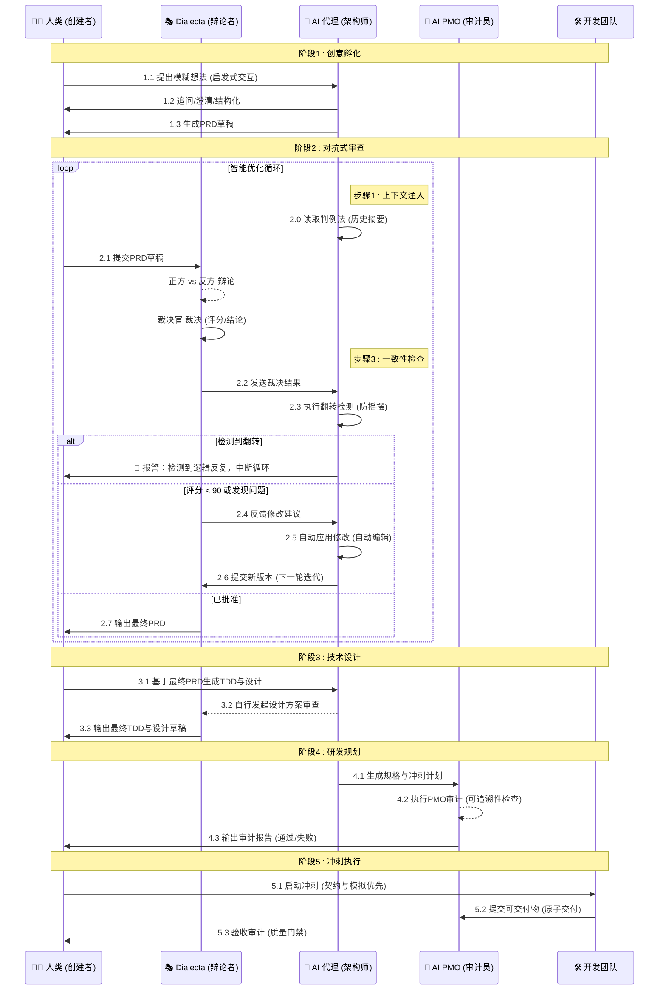
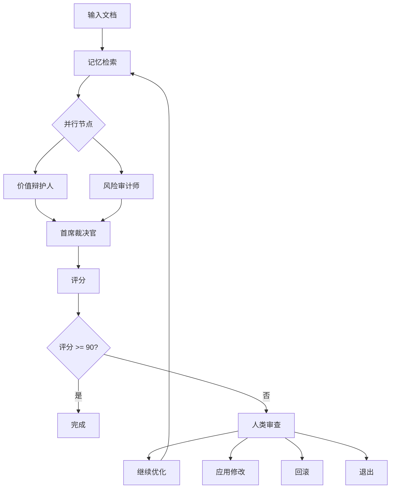

# 项目概述

<cite>
**本文档引用文件**   
- [README.md](file://README.md)
- [THE_COUNCIL_GENESIS.md](file://docs/methodology/THE_COUNCIL_GENESIS.md)
- [AI_DRIVEN_PRODUCT_PROCESS.md](file://docs/methodology/AI_DRIVEN_PRODUCT_PROCESS.md)
- [PRD.md](file://docs/references/PRD.md)
- [council-debate.md](file://docs/guide/council-debate.md)
- [Product-concept-diagram2.5D-Style.md](file://assets/Product-concept-diagram2.5D-Style.md)
- [main.go](file://cmd/council/main.go)
- [engine.go](file://internal/core/workflow/engine.go)
- [service.go](file://internal/core/memory/service.go)
</cite>

## 目录
1. [引言](#引言)
2. [核心愿景与设计哲学](#核心愿景与设计哲学)
3. [系统定位与“理事会”隐喻](#系统定位与“理事会”隐喻)
4. [辩论式AI工作流机制](#辩论式ai工作流机制)
5. [结构化问题解决流程](#结构化问题解决流程)
6. [关键交互场景](#关键交互场景)
7. [系统边界与目标用户](#系统边界与目标用户)
8. [典型使用场景](#典型使用场景)
9. [可扩展性与开闭原则](#可扩展性与开闭原则)

## 引言

The Council 是一个创新的AI驱动的多智能体协作决策平台，旨在通过结构化的辩论式工作流，将人类的创造力与AI的分析能力深度融合。本项目不仅是一个软件工具，更是一种全新的“人机共创”范式，通过对抗式审查、智能工作流和严格的质量门禁，实现从模糊想法到成熟产品的高效转化。

**Section sources**
- [README.md](file://README.md#L1-L352)
- [PRD.md](file://docs/references/PRD.md#L1-L180)

## 核心愿景与设计哲学

The Council 的核心愿景是打造一个“思维外脑容器”，让用户不再是孤独的决策者，而是“理事会”的主席。通过可视化的工作流编排，用户可以组建不同的“群组”，指挥多个AI专家针对提案进行深度协作、辩论与评审，并将产生的智慧沉淀为长期的私有知识资产。

其设计哲学基于四大原则：
1.  **契约优先 (Contract First)**：前后端并行，接口先行。
2.  **模拟优先 (Mock First)**：不等待依赖，先跑通流程。
3.  **原子交付 (Atomic Delivery)**：每一次提交都是可运行的版本。
4.  **严格门禁 (Strict Quality Gates)**：Spec -> Test -> Code -> Audit，缺一不可。

**Section sources**
- [THE_COUNCIL_GENESIS.md](file://docs/methodology/THE_COUNCIL_GENESIS.md#L1-L98)
- [AI_DRIVEN_PRODUCT_PROCESS.md](file://docs/methodology/AI_DRIVEN_PRODUCT_PROCESS.md#L1-L268)

## 系统定位与“理事会”隐喻

The Council 的系统定位是“可视化的多智能体协作决策系统 & 个人私有智库”。其名称“理事会”是一个核心隐喻，将AI决策过程比作一个由不同专家组成的董事会。

在这个隐喻下：
- **用户**是“主席”，负责设定议程、提供输入和做出最终决策。
- **AI智能体**是“理事”，每个都有独特的角色、专长和视角（如价值辩护人、风险审计师、首席裁决官）。
- **工作流**是“会议议程”，定义了辩论、投票、事实核查等环节的顺序和规则。

这种隐喻将复杂的AI协作过程转化为一个直观、易于理解的组织行为模型。

**Section sources**
- [PRD.md](file://docs/references/PRD.md#L1-L180)
- [council-debate.md](file://docs/guide/council-debate.md#L1-L161)

## 辩论式AI工作流机制

The Council 的核心机制是“辩论式AI工作流”，通过多角色AI的对抗性协作来锻造卓越决策。

### 核心组件
- **多角色对抗 (Multi-Persona Debate)**：
  - **正方 (Pro)**：全力维护现有方案，寻找亮点。
  - **反方 (Con)**：魔鬼代言人，无情挖掘漏洞和风险。
  - **裁决官 (Judge)**：上帝视角，评估双方论点，给出公正评分和建议。
- **智能循环 (Auto-Optimization Loop)**：系统可配置最大循环次数，在无人值守的情况下自动进行“辩论 -> 修改 -> 再辩论”的迭代，直到评分达标。
- **判例法记忆 (Common Law Memory)**：系统会读取历史裁决，防止在新的一轮修改中重犯错误或发生逻辑反复。

### 工作流节点
系统通过可视化节点构建工作流：
- **Agent节点**：绑定一个AI角色进行发言。
- **Vote节点**：进行民主决策，设置通过阈值。
- **Loop节点**：进行迭代优化，直到达成共识或达到最大轮数。
- **FactCheck节点**：集成Tavily Search，进行事实核查，阻断集体幻觉。
- **HumanReview节点**：强制暂停流程，等待人类介入决策。



**Diagram sources**
- [AI_DRIVEN_PRODUCT_PROCESS.md](file://docs/methodology/AI_DRIVEN_PRODUCT_PROCESS.md#L26-L77)

**Section sources**
- [AI_DRIVEN_PRODUCT_PROCESS.md](file://docs/methodology/AI_DRIVEN_PRODUCT_PROCESS.md#L82-L268)
- [council-debate.md](file://docs/guide/council-debate.md#L1-L161)

## 结构化问题解决流程

The Council 通过一个结构化的流程来解决复杂问题，确保决策的高可信度。

### 三层记忆协议
系统采用三层记忆协议来管理知识，解决传统RAG系统的“记忆污染”问题。
1.  **隔离区 (Quarantine)**：会议产生的所有对话和结论默认物理隔离，防止低质量讨论污染核心智库。
2.  **工作记忆 (Working Memory)**：构建一个短时效的“热缓存”，填补“归档前”的记忆真空期，确保当前会议能引用到最新的未归档信息。
3.  **长期知识 (Long-Term Knowledge)**：支持周期性生成“智能简报”，用户可一键将经过验证的高价值洞察“晋升”写入长期记忆库。

### 防幻觉与安全机制
- **事实核查 (FactCheck)**：集成Tavily Search，让AI拥有实时查证事实的能力。
- **逻辑熔断 (Circuit Breaker)**：检测到死循环或无效对话时，触发系统硬停止，需用户手动介入。
- **人机回环 (Human-in-the-Loop)**：`HumanReview`节点强制暂停流程，等待人类批准或驳回，确保最终决策权在人类手中。



**Diagram sources**
- [README.md](file://README.md#L130-L145)
- [council-debate.md](file://docs/guide/council-debate.md#L78-L96)

**Section sources**
- [PRD.md](file://docs/references/PRD.md#L138-L155)
- [service.go](file://internal/core/memory/service.go#L1-L209)

## 关键交互场景

### 会议启动
1.  用户选择一个“群组”（如“The Council”）。
2.  创建一个新会议，选择一个预置的“工作流模板”（如“Council Debate”）。
3.  上传或粘贴待审议的文档。
4.  系统进行成本预估，用户确认后启动会议。

### 智能体辩论
- **并行渲染**：多个AI智能体的思考过程和发言在聊天面板中并行渲染，用户可以实时观察每个智能体的动态。
- **状态同步**：左侧的工作流画布实时同步当前正在执行的节点，高亮显示并显示Token消耗。

### 人类干预点
当流程到达`HumanReview`节点时，系统会暂停并弹出一个模态框，用户可以：
- **继续优化**：进入下一轮辩论。
- **应用修改**：将裁决官的建议应用到文档。
- **回滚**：恢复到本轮辩论前的文档版本。
- **退出**：立即结束流程，输出当前状态报告。

**Section sources**
- [council-debate.md](file://docs/guide/council-debate.md#L49-L108)
- [MeetingRoom.tsx](file://frontend/src/features/meeting/MeetingRoom.tsx#L1-L233)

## 系统边界与目标用户

### 系统边界
- **包含**：多智能体协作、可视化工作流编排、三层记忆管理、事实核查、人机回环、成本预估。
- **不包含**：代码执行（Phase 2启用）、移动端原生应用、第三方数据同步。

### 目标用户画像
- **AI产品经理**：需要快速验证产品想法，进行多角度分析。
- **技术决策者**：需要评估技术方案的优劣，进行代码评审。
- **创业者与管理者**：需要对商业计划书进行压力测试，做出高可信度决策。

**Section sources**
- [PRD.md](file://docs/references/PRD.md#L1-L180)

## 典型使用场景

1.  **商业计划书压力测试**：用户上传商业计划书，启动“商业计划压测”流程。价值辩护人挖掘战略价值，风险审计师识别潜在风险，首席裁决官给出综合评分和改进建议。
2.  **代码评审**：用户上传代码片段，启动“代码评审”流程。多个AI智能体从安全、性能、可维护性等角度进行并行审查，通过表决和事实核查后，生成评审报告。
3.  **个人知识管理**：用户将日常思考和文档输入系统，通过“记忆晋升”机制，将高质量的洞察沉淀为长期的私有知识资产。

**Section sources**
- [PRD.md](file://docs/references/PRD.md#L92-L95)

## 可扩展性与开闭原则

The Council 的设计遵循开闭原则，对扩展开放，对修改关闭。

### 可扩展性
- **插件化节点**：通过`NodeFactory`，可以轻松添加新的节点类型（如`CodeExecutionNode`）。
- **多模型支持**：`LLM Registry`支持OpenAI、Gemini、DeepSeek等多个LLM提供商，用户可为每个Agent单独配置。
- **自定义工作流**：用户可以通过“向导模式”用自然语言描述需求，系统自动生成工作流，或手动在画布上创建复杂流程。

### 开闭原则设计
- **核心引擎 (Engine)**：负责流程的调度和执行，不关心具体节点的实现。
- **节点处理器 (NodeProcessor)**：每个节点类型（Agent、Vote、Loop等）都有独立的处理器实现，新增节点不影响核心引擎。
- **中间件 (Middleware)**：通过中间件（如`fact_check.go`, `memory.go`）在不修改核心逻辑的情况下，注入安全、记忆等横切关注点。

这种设计确保了系统的核心稳定，同时允许功能的灵活扩展。

```mermaid
classDiagram
    class Engine {
        +Graph : GraphDefinition
        +Status : map[string]NodeStatus
        +NodeFactory : func(node *Node) (NodeProcessor, error)
        +StreamChannel : chan StreamEvent
        +Run(ctx context.Context)
        +executeNode(ctx context.Context, nodeID string, input map[string]interface{})
        +handleParallel(ctx context.Context, node *Node, input map[string]interface{})
    }
    class NodeProcessor {
        <<interface>>
        +Process(ctx context.Context, input map[string]interface{}, stream chan StreamEvent) : map[string]interface{}
    }
    class AgentProcessor {
        +NodeID : string
        +AgentID : string
        +AgentRepo : agent.Repository
        +Registry : llm.Registry
        +Process(ctx context.Context, input map[string]interface{}, stream chan StreamEvent) : map[string]interface{}
    }
    class VoteProcessor {
        +Threshold : float64
        +VoteType : string
        +Process(ctx context.Context, input map[string]interface{}, stream chan StreamEvent) : map[string]interface{}
    }
    class LoopProcessor {
        +MaxRounds : int
        +ExitOnScore : int
        +Process(ctx context.Context, input map[string]interface{}, stream chan StreamEvent) : map[string]interface{}
    }
    class HumanReviewProcessor {
        +TimeoutMinutes : int
        +AllowSkip : bool
        +Process(ctx context.Context, input map[string]interface{}, stream chan StreamEvent) : map[string]interface{}
    }
    Engine --> NodeFactory : "使用"
    NodeFactory --> NodeProcessor : "创建"
    NodeProcessor <|-- AgentProcessor : "实现"
    NodeProcessor <|-- VoteProcessor : "实现"
    NodeProcessor <|-- LoopProcessor : "实现"
    NodeProcessor <|-- HumanReviewProcessor : "实现"
```

**Diagram sources**
- [engine.go](file://internal/core/workflow/engine.go#L1-L246)
- [factory.go](file://internal/core/workflow/nodes/factory.go#L1-L106)

**Section sources**
- [engine.go](file://internal/core/workflow/engine.go#L1-L246)
- [main.go](file://cmd/council/main.go#L1-L150)