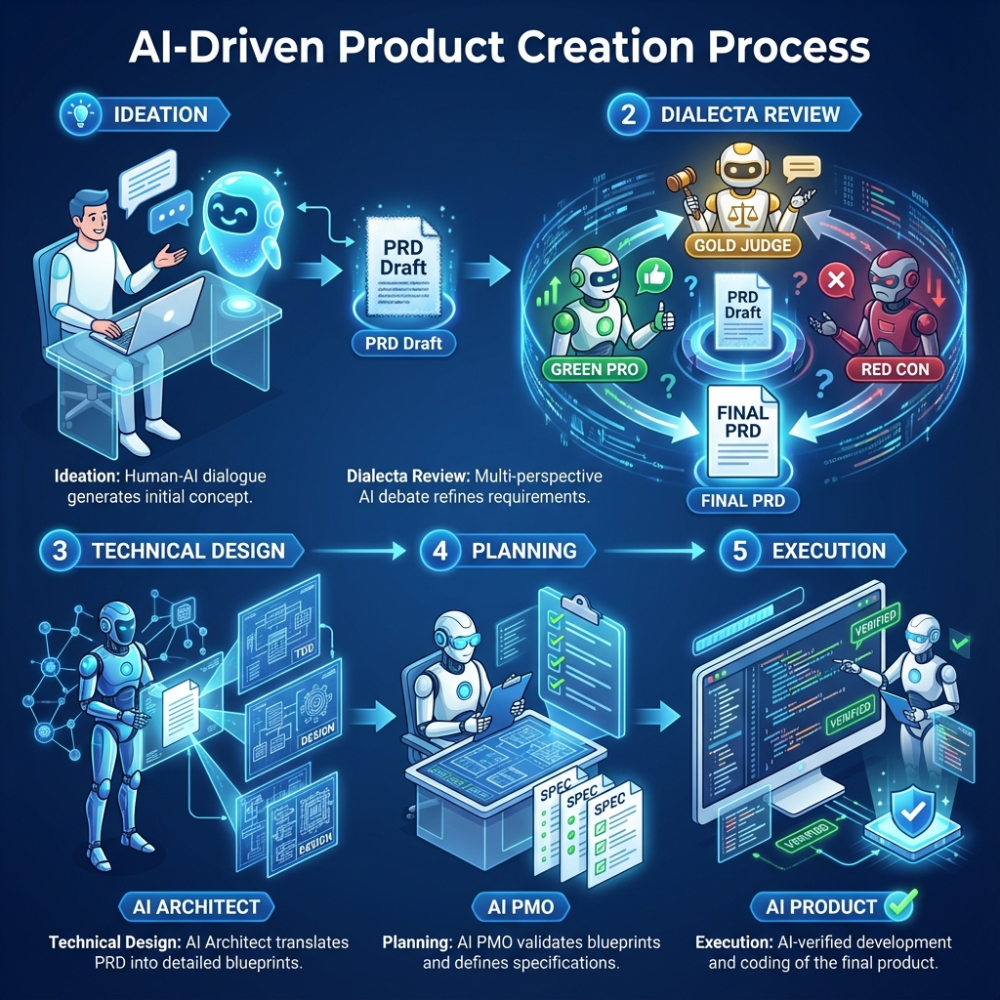
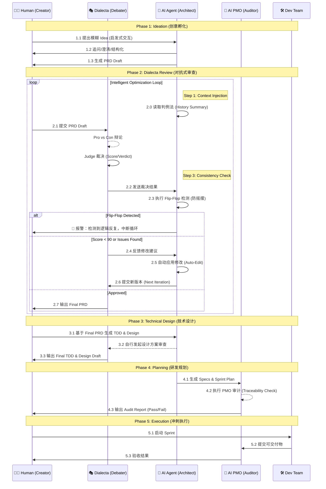

# AI 驱动的产品创设与实现流程方法论

> **作者**: The Council 团队  
> **版本**: v2.0 (Methodology Optimized)  
> **日期**: 2024-12-16  
> **案例**: The Council (AI Native Workspace)

---

## 📖 引言

本文档记录了一种创新的 **AI 原生产品开发方法论**——将人类的创造力与 AI 的分析能力深度融合，通过结构化的对抗式审查、智能工作流和严格的质量门禁，实现从模糊 Idea 到成熟产品的高效转化。

这是一种 **"人机共创 (Human-AI Co-Creation)"** 的全新范式：
- **人类**：负责愿景输入、价值判断和最终决策。
- **AI (Dialecta)**：负责多角度辩论、漏洞挖掘和方案优化。
- **AI (PMO)**：负责规格审计、一致性检查和进度追踪。

---

## 🗺️ 全流程可视化

### 核心阶段流转图





---

## ⚙️ 核心工具链：Dialecta

**仓库**: [`github.com/hrygo/dialecta`](https://github.com/hrygo/dialecta)

**Dialecta** 是本流程的核心引擎，一个多角色 AI 辩论系统。它克服了单一 LLM 的“盲目顺从”和“幻觉”问题，通过对抗产生真知。

### 核心机制
1.  **多角色对抗 (Multi-Persona Debate)**
    *   **Pro (正方)**：全力维护现有方案，寻找亮点。
    *   **Con (反方)**：魔鬼代言人，无情挖掘漏洞和风险。
    *   **Judge (裁决)**：上帝视角，评估双方论点，给出公正评分和建议。
2.  **智能循环 (Auto-Optimization Loop)**
    *   系统可配置 `max_loops`，在无人值守的情况下自动进行 "辩论 -> 修改 -> 再辩论" 的迭代，直到评分达标。
3.  **判例法记忆 (Common Law Memory)**
    *   Dialecta 会读取历史裁决 (`history_summary.md`)，防止在新的一轮修改中重犯错误或发生 "Flip-Flop" (反复横跳)。

---

## 🌱 Phase 1: 创意孵化 (Ideation)

### 1.1 方法：启发式交互
与 AI 进行苏格拉底式对话，利用 **5W1H** 和 **反向推演** 技巧，将 *"我想做..."* 这样的一句话，扩展为包含核心功能、用户画像和痛点的 PRD 草案。

### 1.2 产出物
- **PRD Draft**: 包含基础功能列表和核心逻辑的结构化草稿。

---

## ⚔️ Phase 2: PRD 对抗式审查 (Dialecta Process)

### 2.1 目标
通过高强度的 AI 辩论，在写下一行代码前，发现逻辑漏洞和产品缺陷。

### 2.2 流程
1.  **AI 立论**：正方阐述方案价值。
2.  **AI 驳论**：反方攻击方案弱点（如：成本失控、隐私泄露、用户疲劳）。
3.  **AI 裁决**：Judge 给出 Verdict (通过/条件通过/驳回) 和修改建议。
4.  **智能循环**: 系统自动应用修改建议，并进行下一轮辩论，直至评分达到预设阈值。

### 2.3 产出物
- **Final PRD**: 经过多轮洗礼，逻辑严密的文档。
- **Debate Reports**: 详细的辩论记录，作为决策依据。

---

## 📐 Phase 3: 技术设计 (Technical Design)

### 3.1 双轨并行设计
- **TDD (Technical Design Doc)**: 架构、接口、数据结构。
- **Design Draft**: UI/UX 布局、交互流程、视觉规范。

### 3.2 Design 审查
设计方案同样需要经过 Dialecta 审查。AI 会针对设计蓝图中的交互逻辑、安全隐患进行对抗性推演，确保设计方案不仅美观，而且健壮。

### 3.3 产出物
- **TDD & Design Draft** (Production Ready)

---

## 📋 Phase 4: 研发规划 (Planning) & AI PMO 审计

### 4.1 规格生成 (Spec Generation)
AI 架构师基于技术蓝图（TDD & Design Draft），将其**细化并衍生**为海量的、高精度的**初始 Spec 文档**（Content Expansion）。
*   每份 Spec 都包含明确的接口定义、测试用例要求和验收标准，为开发提供原子化的执行指令。

### 4.2 AI PMO 审计 (The AI Auditor)
这是一个完全由 **AI 扮演 PMO** 执行的闭环验证过程，其深度远超传统的人工 Review。

#### 审计逻辑闭环：
1.  **全局读取 (Full Context Audit)**: AI 同时读取 PRD, TDD, Design Draft 以及刚生成的所有 Specs。
2.  **差距分析 (Gap Analysis)**:
    *   构建 **"需求-实现" 矩阵**，逐条核对 PRD 功能点 (Feature ID) 是否在 Spec 中有对应的验收标准。
3.  **自动增补 (Auto-Remediation)**:
    *   一旦发现 Gap，AI PMO 自动触发 `Create Spec` 动作，补齐缺失的规格。
4.  **追溯性锁定 (Traceability Lock)**:
    *   确保 Spec 没有违背 TDD 定义的架构原则（如：前端状态必须遵循 Zustand Store 定义）。

### 4.3 审计成果 (Metrics)
通过这种 **"生成 -> 审计 -> 增补 -> 再审计"** 的自动化流程，最终交付物将达到极高的质量标准：
- **Specs 完整性**: 确保 0 遗漏。
- **PRD 覆盖率**: 逼近 100%。
- **效率**: 将数天的 PM 工作压缩至分钟级。

### 4.4 产出物
- **Development Plan**
- **Specs 集合** (完整覆盖)
- **Audit Report** (包含 Traceability Matrix)

---

## 🚀 Phase 5: 冲刺执行 (Execution)

### 5.1 TDD 开发模式
开发者依据 Spec 和 Test Case 进行编码：红 (Fail) -> 绿 (Pass) -> 蓝 (Refactor)。

### 5.2 验收
每个 Sprint 结束，对照 Spec 中的 **验收标准 (Acceptance Criteria)** 进行逐项确认。

---

## 📝 附录：实战案例 - The Council

**The Council** 项目自身是该方法论的最佳实践证明。我们让 AI 参与了从概念定义到代码落地的全过程，以下是基于真实辩论数据 (`docs/reports/`) 整理的**"审查进化史"**。

### 1. 演进故事线 (The Audit Storyline)

通过 Dialecta 的对抗式审查，我们在写下一行代码前，就规避了数月的无效开发。

#### Act 1: 概念验证 (Phase 2 - PRD)
*从“虽然很酷但不可用”到“商业逻辑闭环”*

| 轮次   | 阶段     | 评分   | 毒舌 AI (Con) 的致命攻击                                                                                  | 修正动作                                                                 | 挽回损失                         |
| :----- | :------- | :----- | :-------------------------------------------------------------------------------------------------------- | :----------------------------------------------------------------------- | :------------------------------- |
| **R1** | PRD v0.8 | **72** | **"The Zero-Grounding Fallacy"**: MVP 禁用联网，三个 Agent 只是在互相确认幻觉。这只是个昂贵的数字过家家。 | ✅ **强制集成工具链**: 将 Tavily Search 和 Python 解释器列为 MVP 核心。   | 避免了产品上线即崩塌的逻辑硬伤。 |
| **R2** | PRD v0.9 | **78** | **"Hardware Mismatch"**: 在用户笔记本上跑 Postgres？这是运维噩梦。别试图在 Electron 里塞服务器架构。      | ✅ **架构轻量化**: 降级为 **SQLite + Local Vector**，确保消费级硬件可用。 | **节省 2 个月**的重构时间。      |

#### Act 2: 设计与安全 (Phase 3 - Design)
*从“逻辑自洽”到“防御性工程”*

| 轮次   | 阶段        | 评分   | 毒舌 AI (Con) 的致命攻击                                                                        | 修正动作                                                   | 价值提升                         |
| :----- | :---------- | :----- | :---------------------------------------------------------------------------------------------- | :--------------------------------------------------------- | :------------------------------- |
| **R3** | Design v1.0 | **90** | **"The Memory Gap"**: 记忆需 7 天后晋升，导致 RAG 检索存在时效性漏洞。今日决策明日无法 Recall。 | ✅ **引入短期工作记忆**: 允许 Unverified 记忆被低权重检索。 | 修复了“第二大脑”的核心逻辑断层。 |
| **R4** | Design v1.2 | **92** | **"Cognitive Disaster"**: 并行发言采用横向滚动 (Horizontal Scroll) 严重破坏阅读流，反人类交互。 | ✅ **布局重构**: 改为垂直交错 (Timeline Style) 布局。       | 避免了上线后的用户体验灾难。     |

#### Act 3: 规格落地 (Phase 4 - Planning)
*AI PMO 的“暴力”审计*

在确认 PRD 和 Design 无误后，AI PMO 对生成的 32 份 Specs 进行了地毯式核查。

*   **输入**: 1.2万字 Design Draft + PRD v1.5
*   **输出**: 32 份 Specs (5.2万字)
*   **审计结果**:
    *   **PRD 覆盖率**: **98%** (AI 发现并补全了 "NL2Workflow 向导模式")
    *   **UI 覆盖率**: **92%** (AI 发现并补全了 "God Mode 开关")
    *   **TDD 一致性**: **100%** (确保前端 State 严格遵循 Zustand 定义)
*   **效能对比**: AI 耗时 **5 分钟** vs 人工 **2-3 天**。

### 2. 结论 (Conclusion)

通过 **"Human Vision + AI Auditing"** 的模式，我们实现了一个看似悖论的目标：**虽然增加了流程环节（辩论、审计），但却极大地压缩了总体开发周期。**

因为我们消灭了软件工程中最大的成本来源——**返工 (Rework)**。

> *"We built a solid product by using AI to govern AI."*
```
