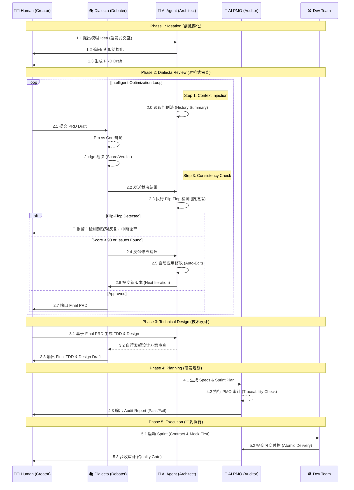

# AI 驱动的产品创设与实现流程方法论

> **作者**: The Council 团队  
> **版本**: v2.1 (Genesis Edition)  
> **日期**: 2025-12-17  
> **案例**: The Council (AI Native Workspace)

---

## 📖 引言

本文档记录了一种创新的 **AI 原生产品开发方法论**——将人类的创造力与 AI 的分析能力深度融合，通过结构化的对抗式审查、智能工作流和严格的质量门禁，实现从 **模糊 Idea** 到 **成熟产品** 的高效转化。

这是一种 **"人机共创 (Human-AI Co-Creation)"** 的全新范式：
- **人类**：负责愿景输入、价值判断和最终决策。
- **AI (Dialecta)**：负责多角度辩论、漏洞挖掘和方案优化。
- **AI (PMO)**：负责规格审计、一致性检查和进度追踪。

---

## 🗺️ 全流程可视化

### 核心阶段流转图

---

## ⚙️ 核心工具链：Dialecta

**仓库**: [`github.com/hrygo/dialecta`](https://github.com/hrygo/dialecta)

**Dialecta** 是本流程的核心引擎，一个多角色 AI 辩论系统。它克服了单一 LLM 的“盲目顺从”和“幻觉”问题，通过对抗产生真知。

### 核心机制
1.  **多角色对抗 (Multi-Persona Debate)**
    *   **Pro (正方)**：全力维护现有方案，寻找亮点。
    *   **Con (反方)**：魔鬼代言人，无情挖掘漏洞和风险。
    *   **Judge (裁决)**：上帝视角，评估双方论点，给出公正评分和建议。
2.  **智能循环 (Auto-Optimization Loop)**
    *   系统可配置 `max_loops`，在无人值守的情况下自动进行 "辩论 -> 修改 -> 再辩论" 的迭代，直到评分达标。
3.  **判例法记忆 (Common Law Memory)**
    *   Dialecta 会读取历史裁决 (`history_summary.md`)，防止在新的一轮修改中重犯错误或发生 "Flip-Flop" (反复横跳)。

---

## 🌱 Phase 1: 创意孵化 (Ideation)

### 1.1 方法：启发式交互
与 AI 进行苏格拉底式对话，利用 **5W1H** 和 **反向推演** 技巧，将 *"我想做..."* 这种模糊的原始诉求，扩展为包含核心功能、用户画像和痛点的 PRD 草案。

### 1.2 产出物
- **PRD Draft**: 包含基础功能列表和核心逻辑的结构化草稿。

---

## ⚔️ Phase 2: PRD 对抗式审查 (Dialecta Process)

### 2.1 目标
通过高强度的 AI 辩论，在写下一行代码前，发现逻辑漏洞和产品缺陷。

### 2.2 流程
1.  **AI 立论**：正方阐述方案价值。
2.  **AI 驳论**：反方攻击方案弱点（如：成本失控、隐私泄露、用户疲劳）。
3.  **AI 裁决**：Judge 给出 Verdict (通过/条件通过/驳回) 和修改建议。
4.  **智能循环**: 系统自动应用修改建议，并进行下一轮辩论，直至评分达到预设阈值。

### 2.3 产出物
- **Final PRD**: 经过多轮洗礼，逻辑严密的文档。
- **Debate Reports**: 详细的辩论记录，作为决策依据。

---

## 📐 Phase 3: 技术设计 (Technical Design)

### 3.1 双轨并行设计
- **TDD (Technical Design Doc)**: 架构、接口、数据结构。
- **Design Draft**: UI/UX 布局、交互流程、视觉规范。

### 3.2 Design 审查
设计方案同样需要经过 Dialecta 审查。AI 会针对设计蓝图中的交互逻辑、安全隐患进行对抗性推演，确保设计方案不仅美观，而且健壮。

### 3.3 产出物
- **TDD & Design Draft** (Production Ready)

---

## 📋 Phase 4: 研发规划 (Planning) & AI PMO 审计

### 4.1 规格生成 (Spec Generation)
AI 架构师基于技术蓝图（TDD & Design Draft），将其**细化并衍生**为海量且高精度的**初始 Spec 文档**（Content Expansion）。
*   每份 Spec 都包含明确的接口定义、测试用例要求和验收标准，为开发提供原子化的执行指令。

### 4.2 AI PMO 审计 (The AI Auditor)
这是一个完全由 **AI 扮演 PMO** 执行的闭环验证过程，其深度远超传统的人工 Review。

#### 审计逻辑闭环：
1.  **全局读取 (Full Context Audit)**: AI 同时读取 PRD, TDD, Design Draft 以及刚生成的所有 Specs。
2.  **差距分析 (Gap Analysis)**:
    *   构建 **"需求-实现" 矩阵**，逐条核对 PRD 功能点 (Feature ID) 是否在 Spec 中有对应的验收标准。
3.  **自动增补 (Auto-Remediation)**:
    *   一旦发现 Gap，AI PMO 自动触发 `Create Spec` 动作，补齐缺失的规格。
4.  **追溯性锁定 (Traceability Lock)**:
    *   确保 Spec 没有违背 TDD 定义的架构原则（如：前端状态必须遵循 Zustand Store 定义）。

### 4.3 审计成果 (Metrics)
通过这种 **"生成 -> 审计 -> 增补 -> 再审计"** 的自动化流程，最终交付物将达到极高的质量标准：
- **Specs 完整性**: 确保 0 遗漏。
- **PRD 覆盖率**: 逼近 100%。
- **效率**: 将数天的 PM 工作压缩至分钟级。

### 4.4 产出物
- **Development Plan**
- **Specs 集合** (完整覆盖)
- **Audit Report** (包含 Traceability Matrix)

---

## 🚀 Phase 5: 冲刺执行 (Execution)

### 5.1 执行原则 (Execution Principles)
基于 *The Council* 的实战经验，我们确立了四大黄金原则：
1. **Contract First (契约优先)**: 前后端并行，接口定义（Spec）先行。
2. **Mock First (模拟优先)**: 前端不依赖后端实现，先基于各种 Mock 数据跑通交互。
3. **Atomic Delivery (原子交付)**: 每一次 Commit 必须是“可编译、可运行”的完整逻辑单元。
4. **Strict Quality Gates (严格门禁)**: Spec -> Test -> Code -> Audit，缺一不可。

### 5.2 TDD 开发模式
开发者依据 Spec 和 Test Case 进行编码：红 (Fail) -> 绿 (Impl) -> 蓝 (Refactor)。

### 5.3 验收
| **记忆时效** | 7天隔离期 | **"Memory Gap"**: “今日的决策明日无法 Recall，你的第二大脑有健忘症。”      | ✅ **引入 Working Memory**: 允许低权重检索未验证记忆。  |
| **阅读体验** | 横向滚动  | **"Cognitive Disaster"**: “横向滚动长文本是反人类的交互，用户会关掉应用。” | ✅ **改为 Timeline 布局**: 垂直交错显示，符合阅读直觉。 |

#### Act 3: 极限精度的规划 (Planning Precision)
*Dec 16, 16:00 PM - Spec Generation*

AI 架构师与 AI PMO 配合，在 **5分钟** 内完成了人类 PM 需要数天的工作量。

*   **输入**: 1.2万字 Design Draft + PRD v1.5
*   **输出**: **32 份** 详细 Specs (涵盖接口、数据库、UI细节)
*   **PMO 审计结果** (`docs/reports/specs_audit_report.md`):
    *   PRD 功能覆盖率: **98%** (自动补全了 `SPEC-206` 向导模式)
    *   Design UI 覆盖率: **92%** (自动补全了 God Mode 开关)
    *   TDD 一致性: **98%**

> **⚡️ 效能**: 实现了 **32:1** 的 Spec 产出比，且保证了 **Traceability Matrix** 的完整性。

#### Act 4: 诚实的执行 (Honest Execution)
*Dec 16, 19:00 PM - Implementation Audit*

AI PMO 不仅规划，还无情地揭示了实现的差距 (`docs/reports/audit_report.md`)，防止项目虚假繁荣。

*   **后端 Engine**: 70% 完成 (Vote/Loop 节点暂缺)
*   **前端 Store**: **❌ 严重缺失** (即时发现 `useSessionStore` 无法支撑 Run Mode)
*   **动作**: 立即自动触发了紧急修复任务 (`fix: implement session control`).

### 3. 结论 (Conclusion)

通过 **"Human Vision + AI Auditing"** 的模式，我们实现了一个看似悖论的目标：**虽然增加了流程环节（辩论、审计），但却极大地压缩了总体开发周期。**

因为我们消灭了软件工程中最大的成本来源——**返工 (Rework)**。

> *"We built a solid product by using AI to govern AI."*
