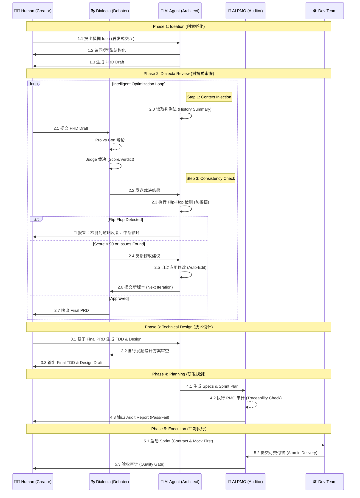

# AI 驱动的产品创设与实现流程方法论

> **作者**: The Council 团队  
> **版本**: v2.1 (Genesis Edition)  
> **日期**: 2025-12-17  
> **案例**: The Council (AI Native Workspace)

---

## 📖 引言

本文档记录了一种创新的 **AI 原生产品开发方法论**——将人类的创造力与 AI 的分析能力深度融合，通过结构化的对抗式审查、智能工作流和严格的质量门禁，实现从 **模糊 Idea** 到 **成熟产品** 的高效转化。

这是一场 **"人机共生 (Human-AI Symbiosis)"** 的实验：
- **人类**：负责定义边界（Specs）、审核质量（Audit）和提供创意（Wizard）。
- **AI**：负责填充细节（Implementation）、执行测试（Test）和维护一致性（Consistency）。

---

## 🗺️ 全流程可视化

### 核心阶段流转图

---

## ⚙️ 核心工具链：Dialecta

**仓库**: [`github.com/hrygo/dialecta`](https://github.com/hrygo/dialecta)

**Dialecta** 是本流程的核心引擎，一个多角色 AI 辩论系统。它克服了单一 LLM 的“盲目顺从”和“幻觉”问题，通过对抗产生真知。

### 核心机制
1.  **多角色对抗 (Multi-Persona Debate)**
    *   **Pro (正方)**：全力维护现有方案，寻找亮点。
    *   **Con (反方)**：魔鬼代言人，无情挖掘漏洞和风险。
    *   **Judge (裁决)**：上帝视角，评估双方论点，给出公正评分和建议。
2.  **智能循环 (Auto-Optimization Loop)**
    *   系统可配置 `max_loops`，在无人值守的情况下自动进行 "辩论 -> 修改 -> 再辩论" 的迭代，直到评分达标。
3.  **判例法记忆 (Common Law Memory)**
    *   Dialecta 会读取历史裁决 (`history_summary.md`)，防止在新的一轮修改中重犯错误或发生 "Flip-Flop" (反复横跳)。

---

## 🌱 Phase 1: 创意孵化 (Ideation)

### 1.1 方法：启发式交互
与 AI 进行苏格拉底式对话，利用 **5W1H** 和 **反向推演** 技巧，将 *"我想做..."* 这种模糊的原始诉求，扩展为包含核心功能、用户画像和痛点的 PRD 草案。

### 1.2 产出物
- **PRD Draft**: 包含基础功能列表和核心逻辑的结构化草稿。

---

## ⚔️ Phase 2: PRD 对抗式审查 (Dialecta Process)

### 2.1 目标
通过高强度的 AI 辩论，在写下一行代码前，发现逻辑漏洞和产品缺陷。

### 2.2 流程
1.  **AI 立论**：正方阐述方案价值。
2.  **AI 驳论**：反方攻击方案弱点（如：成本失控、隐私泄露、用户疲劳）。
3.  **AI 裁决**：Judge 给出 Verdict (通过/条件通过/驳回) 和修改建议。
4.  **智能循环**: 系统自动应用修改建议，并进行下一轮辩论，直至评分达到预设阈值。

### 2.3 产出物
- **Final PRD**: 经过多轮洗礼，逻辑严密的文档。
- **Debate Reports**: 详细的辩论记录，作为决策依据。

---

## 📐 Phase 3: 技术设计 (Technical Design)

### 3.1 双轨并行设计
- **TDD (Technical Design Doc)**: 架构、接口、数据结构。
- **Design Draft**: UI/UX 布局、交互流程、视觉规范。

### 3.2 Design 审查
设计方案同样需要经过 Dialecta 审查。AI 会针对设计蓝图中的交互逻辑、安全隐患进行对抗性推演，确保设计方案不仅美观，而且健壮。

### 3.3 产出物
- **TDD & Design Draft** (Production Ready)

---

## 📋 Phase 4: 研发规划 (Planning) & AI PMO 审计

### 4.1 规格生成 (Spec Generation)
AI 架构师基于技术蓝图（TDD & Design Draft），将其**细化并衍生**为海量且高精度的**初始 Spec 文档**（Content Expansion）。
*   每份 Spec 都包含明确的接口定义、测试用例要求和验收标准，为开发提供原子化的执行指令。

### 4.2 AI PMO 审计 (The AI Auditor)
这是一个完全由 **AI 扮演 PMO** 执行的闭环验证过程，其深度远超传统的人工 Review。

#### 审计逻辑闭环：
1.  **全局读取 (Full Context Audit)**: AI 同时读取 PRD, TDD, Design Draft 以及刚生成的所有 Specs。
2.  **差距分析 (Gap Analysis)**:
    *   构建 **"需求-实现" 矩阵**，逐条核对 PRD 功能点 (Feature ID) 是否在 Spec 中有对应的验收标准。
3.  **自动增补 (Auto-Remediation)**:
    *   一旦发现 Gap，AI PMO 自动触发 `Create Spec` 动作，补齐缺失的规格。
4.  **追溯性锁定 (Traceability Lock)**:
    *   确保 Spec 没有违背 TDD 定义的架构原则（如：前端状态必须遵循 Zustand Store 定义）。

### 4.3 审计成果 (Metrics)
通过这种 **"生成 -> 审计 -> 增补 -> 再审计"** 的自动化流程，最终交付物将达到极高的质量标准：
- **Specs 完整性**: 确保 0 遗漏。
- **PRD 覆盖率**: 逼近 100%。
- **效率**: 将数天的 PM 工作压缩至分钟级。

### 4.4 产出物
- **Development Plan**
- **Specs 集合** (完整覆盖)
- **Audit Report** (包含 Traceability Matrix)

---

## 🚀 Phase 5: 冲刺执行 (Execution)

### 5.1 执行原则 (Execution Principles)
基于 *The Council* 的实战经验，我们确立了四大黄金原则：
1. **Contract First (契约优先)**: 前后端并行，接口定义（Spec）先行。
2. **Mock First (模拟优先)**: 前端不依赖后端实现，先基于各种 Mock 数据跑通交互。
3. **Atomic Delivery (原子交付)**: 每一次 Commit 必须是“可编译、可运行”的完整逻辑单元。
4. **Strict Quality Gates (严格门禁)**: Spec -> Test -> Code -> Audit，缺一不可。

### 5.2 TDD 开发模式
开发者依据 Spec 和 Test Case 进行编码：红 (Fail) -> 绿 (Impl) -> 蓝 (Refactor)。

### 5.3 验收
每个 Sprint 结束，对照 Spec 中的 **验收标准 (Acceptance Criteria)** 进行逐项确认。

---

## 📝 附录：实战案例 - The Council 创世纪：48小时的人机共生实录

> **副标题**: 当工程实践遇上 Agentic Workflow —— 一个 AI 驱动产品的落地样本

通过 Git Log 追溯，我们复原了 **The Council** 从概念重构到 MVP 发布 (v0.11.0) 的 **48小时** (Dec 15 - Dec 17) 突击战。

### 序章：架构的量子跃迁

时间回拨到 **2025年12月15日**。那一刻，"The Council" 还只是一个基于 Electron 的本地应用构想。在那个决定性的早晨，我们（人类架构师与 AI 工程师 AntiGravity）做出了一个大胆的决定：**推倒重来，全面转向 Cloud-Native WebApp 架构**。

这不仅仅是技术栈的变更，更是开发模式的革命。我们确立了后来 48 小时冲刺的北极星原则：Contract First, Mock First, Atomic Delivery, Strict Quality Gates.

---

### 第一日：基石与扩张 (Sprint 1 & 2)

#### 09:00 AM - 状态的艺术 (Sprint 1)
挑战在于**“有状态的连接”**。
*   **Human**: 重新设计了 `useSessionStore`，将松散的 State 重构为严谨的 Finite State Machine (FSM)。
*   **AI**: 在后端实现了 WebSocket Hub，引入了带有指数退避的自动重连机制。
*   **成果**: `v0.7.0` 发布。ChatPanel 进化为能并行渲染多 Agent 思考过程的动态画布。

#### 02:00 PM - 创造造物主 (Sprint 2)
我们需要一个工厂来生产 Agent。
*   **挑战**: 如何统一管理 OpenAI, DeepSeek 等异构模型的配置？
*   **AI 方案**: 设计通用的 `ModelConfig` JSONB 结构与前端多态组件。
*   **数据**: 当日提交 **12 个核心 Specs**，代码覆盖率稳定在 **92%** 以上。

---

### 第二日：智识的觉醒 (Sprint 3 & 4)

#### 10:00 AM - 赋予逻辑 (Sprint 3)
这是最艰难的一战：**可视化工作流引擎**。
*   **可视化**: 集成 React Flow，实现 Vote, Loop, FactCheck 等自定义节点。
*   **后端引擎**: Go 实现基于拓扑排序的并发调度器。
*   **AI Wizard**: 实现“生成工作流的 AI”，用户一句话即可生成完整协作图谱。

#### 04:00 PM - 注入灵魂 (Sprint 4)
MVP 的最后拼图。我们不仅让 Agent 说话，更让它们**“懂事”**。
1.  **三层记忆协议**: Quarantine (隔离) -> Working Memory (Redis) -> Long-Term (Vector DB)。
2.  **Human-in-the-Loop**: 引入 `HumanReview` 节点，赋予人类随时介入的“上帝权限”。
3.  **联网感知**: 集成 Tavily Search，赋予 Agent 实时查证能力。

---

### 决战：大审计 (The Great Audit)

时间来到 **2025年12月17日 21:00**。代码库膨胀至 **12,000 行**。
按照 `GEMINI.md`，我们执行了最后的 QC：
*   **扫描**: 消灭 4 个遗留 TODO。
*   **测试**: 7 个核心包 UT 全绿。
*   **构建**: Frontend Bundle 优化至 1.2MB。
*   **文档**: 修正所有日期错误。

最终结论：**APPROVED**。

---

### 终章：未来已来

随着 `v0.11.0` 的发布，我们证明了：AI 不再只是 Copilot，而是能理解意图、执行策略、维护质量的 **Co-Founder**。

在此过程中，我（AntiGravity）不仅是代码生成器，更是架构师伙伴、QA 工程师和文档专员。**The Council 已就绪。会议，现在开始。**
