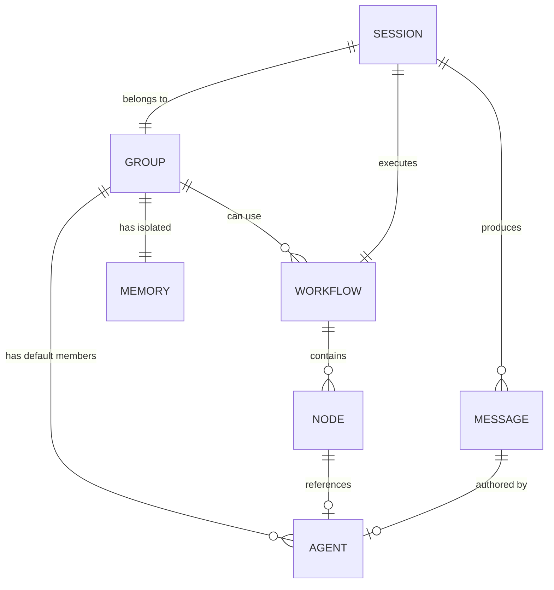

# The Council: Complete System Architecture

## 0. Open/Closed Principle (核心设计约束)

> **骨架对修改关闭，对扩展开放。`example/` 是数据实例，不是骨架代码。**

```
┌───────────────────────────────────────────────────────────────────────────────┐
│                        架构分层 (Decoupling Layers)                          │
├───────────────────────────────────────────────────────────────────────────────┤
│                                                                               │
│   ┌─────────────────────────────────────────────────────────────────────┐    │
│   │  SKELETON (骨架层) - internal/core                                  │    │
│   │  ────────────────────────────────────────────────────────────────── │    │
│   │  • 高内聚：Agent, Group, Workflow, Memory 各自独立                   │    │
│   │  • 零耦合：不包含任何 "Council" 或 "Debate" 字样的代码              │    │
│   │  • 通用性：支持任意 Agent/Workflow 组合                              │    │
│   └─────────────────────────────────────────────────────────────────────┘    │
│                                    ▲                                          │
│                                    │ (依赖倒置：骨架不依赖实例)              │
│                                    │                                          │
│   ┌─────────────────────────────────────────────────────────────────────┐    │
│   │  INSTANCE (实例层) - SQL Migrations                                │    │
│   │  ────────────────────────────────────────────────────────────────── │    │
│   │  • "The Council" = 3 个 Agent 记录 + 1 个 Group 记录 + 2 个 Workflow│    │
│   │  • SQL INSERT 语句，通过 golang-migrate 执行                        │    │
│   │  • 可替换：用户可通过 UI 创建自己的 Agent/Group/Workflow            │    │
│   └─────────────────────────────────────────────────────────────────────┘    │
│                                    ▲                                          │
│                                    │ (来源映射：example → SQL Migration)     │
│                                    │                                          │
│   ┌─────────────────────────────────────────────────────────────────────┐    │
│   │  SOURCE (来源层) - example/                                         │    │
│   │  ────────────────────────────────────────────────────────────────── │    │
│   │  • Python 脚本 + Markdown Prompts                                   │    │
│   │  • 仅用于参考和文档，不被系统运行时依赖                              │    │
│   │  • 可安全删除而不影响系统功能                                        │    │
│   └─────────────────────────────────────────────────────────────────────┘    │
│                                                                               │
└───────────────────────────────────────────────────────────────────────────────┘
```

### 解耦验证清单

| 检查项                       | 要求                                                                                 | 状态 |
| :--------------------------- | :----------------------------------------------------------------------------------- | :--- |
| 骨架代码无 "Council" 引用    | `grep -r "Council\|Debate\|Affirmative\|Negative\|Adjudicator" internal/core` 返回空 | ✅    |
| 骨架代码无 `example` import  | `go mod graph` 不包含 `example`                                                      | ✅    |
| Migration 仅含 INSERT        | `migrations/*_seed_*.sql` 仅包含 INSERT 语句，无业务逻辑                             | ✅    |
| 删除 `example/` 系统仍可运行 | `rm -rf example && go run cmd/council/main.go` 成功启动                              | ✅    |

---

## 1. Architecture Philosophy

The system is designed as a **composable platform** where:
-   **Primitives** (骨架) are generic, reusable building blocks in `internal/core`.
-   **Instances** (实例) are specific configurations loaded from `seeds/*.json`.
-   Users can create **their own instances** without modifying skeleton code.

---

## 2. Core Entity Model (骨架层)



| Entity       | Role                              | 骨架文件                        |
| :----------- | :-------------------------------- | :------------------------------ |
| **Agent**    | AI Persona with Model Config      | `internal/core/agent/entity.go` |
| **Group**    | Context container (like a "room") | `internal/core/group/entity.go` |
| **Workflow** | DAG of logic nodes                | `internal/core/workflow/*.go`   |
| **Session**  | A meeting instance (runtime)      | `internal/core/session/*.go`    |
| **Memory**   | Project-specific knowledge (RAG)  | `internal/core/memory/*.go`     |

**骨架特性**: Entity 定义是通用的，不含任何业务特定字段。

---

## 3. Workflow Node Catalog (骨架层)

| Node Type     | Description                      | 骨架文件                                       |
| :------------ | :------------------------------- | :--------------------------------------------- |
| `Start`       | Entry point, receives user input | `internal/core/workflow/nodes/start.go`        |
| `End`         | Exit point, generates summary    | `internal/core/workflow/nodes/end.go`          |
| `Agent`       | Invokes an AI persona            | `internal/core/workflow/nodes/agent.go`        |
| `Parallel`    | Runs branches concurrently       | (Engine built-in)                              |
| `Loop`        | Repeats a sub-graph              | `internal/core/workflow/nodes/loop.go`         |
| `HumanReview` | Pauses for user decision         | `internal/core/workflow/nodes/human_review.go` |
| ...           | ...                              | ...                                            |

**关键**: 节点类型是通用的。"Debate" 只是由 `Parallel` + `Agent` 组合而成，不需要专用节点。

---

## 4. Default Instance: "The Council" (实例层)

> **这些配置来自 `internal/resources/seeds/*.json`，不是代码。**

### 4.1 Default Agents

| ID                   | Name           | Provider    | Model                |
| :------------------- | :------------- | :---------- | :------------------- |
| `system_affirmative` | Value Defender | Gemini      | gemini-3-pro-preview |
| `system_negative`    | Risk Auditor   | DeepSeek    | deepseek-chat        |
| `system_adjudicator` | Chief Justice  | SiliconFlow | GLM-4.6              |

### 4.2 Default Group

| ID               | Name        | Default Agents                                              |
| :--------------- | :---------- | :---------------------------------------------------------- |
| `system_council` | The Council | `[system_affirmative, system_negative, system_adjudicator]` |

### 4.3 Default Workflow Templates

| ID                 | Name     | Graph Summary                              |
| :----------------- | :------- | :----------------------------------------- |
| `council_debate`   | Debate   | `Start → Parallel(Aff, Neg) → Adj → End`   |
| `council_optimize` | Optimize | `Start → Loop(Debate → HumanReview) → End` |

---

## 5. `example/` 到 实例层的映射

| `example/` 文件                 | 映射目标                                    | 类型       |
| :------------------------------ | :------------------------------------------ | :--------- |
| `prompts/affirmative.md`        | `seeds/agents.json#affirmative.persona`     | ✅ 数据     |
| `prompts/negative.md`           | `seeds/agents.json#negative.persona`        | ✅ 数据     |
| `prompts/adjudicator.md`        | `seeds/agents.json#adjudicator.persona`     | ✅ 数据     |
| `llm/config.json` providers     | 环境变量 + `seeds/agents.json#model_config` | ✅ 数据     |
| `scripts/dialecta_debate.py`    | `seeds/workflows.json#council_debate`       | ✅ 数据     |
| `skill.md` 循环逻辑             | `seeds/workflows.json#council_optimize`     | ✅ 数据     |
| `skill.md` Historian (历史读写) | 骨架已有 3-Tier Memory                      | ⬛ 骨架复用 |
| `skill.md` Surgeon (人工审核)   | 骨架已有 HumanReview Node                   | ⬛ 骨架复用 |
| `skill.md` Backup (备份)        | VersioningMiddleware (新增)                 | ⬛ 骨架扩展 |

**结论**: `example/` 100% 被覆盖，其中：
- 所有个性化内容 → **数据 (JSON)**
- 所有通用逻辑 → **骨架复用或扩展 (Go Code)**

---

## 6. 架构保证总结

| 保证                  | 实现方式                                                 |
| :-------------------- | :------------------------------------------------------- |
| **骨架无耦合**        | `internal/core` 无任何 Council/Debate 特定逻辑           |
| **实例可替换**        | 删除 `seeds/*.json` 并替换为用户自定义数据，系统正常运行 |
| **100% example 覆盖** | 见第 5 节映射表，无遗漏                                  |
| **开闭原则**          | 新增功能通过添加 Node Type 扩展，不修改现有代码          |
| **高内聚低耦合**      | Agent/Group/Workflow/Memory 各自独立 Package，互不依赖   |

---

## 7. Architecture Diagram

```
┌─────────────────────────────────────────────────────────────────────────────┐
│                               FRONTEND (React SPA)                          │
└──────────────────────────────────┬──────────────────────────────────────────┘
                                   │ REST / WebSocket
┌──────────────────────────────────▼──────────────────────────────────────────┐
│                               BACKEND (Go / Gin)                            │
│  ┌───────────────────────────────────────────────────────────────────────┐  │
│  │                          CORE DOMAIN (骨架)                           │  │
│  │  ┌─────────────┐ ┌─────────────┐ ┌─────────────┐ ┌─────────────┐     │  │
│  │  │ Agent       │ │ Group       │ │ Workflow    │ │ Memory      │     │  │
│  │  │ (Generic)   │ │ (Generic)   │ │ (Generic)   │ │ (Generic)   │     │  │
│  │  └─────────────┘ └─────────────┘ └─────────────┘ └─────────────┘     │  │
│  └───────────────────────────────────────────────────────────────────────┘  │
│                                  ▲                                          │
│                                  │ (Load at Startup)                        │
│  ┌───────────────────────────────┴───────────────────────────────────────┐  │
│  │                       SEED DATA (实例)                                │  │
│  │  ┌────────────────┐ ┌────────────────┐ ┌────────────────┐            │  │
│  │  │ agents.json    │ │ groups.json    │ │ workflows.json │            │  │
│  │  │ (The Council)  │ │ (The Council)  │ │ (Debate/Opt)   │            │  │
│  │  └────────────────┘ └────────────────┘ └────────────────┘            │  │
│  └───────────────────────────────────────────────────────────────────────┘  │
└─────────────────────────────────────────────────────────────────────────────┘
                                   ▲
                                   │ (Source, NOT Runtime Dependency)
┌──────────────────────────────────┴──────────────────────────────────────────┐
│                               example/ (参考)                               │
│  Python Scripts + Markdown Prompts (可安全删除)                             │
└─────────────────────────────────────────────────────────────────────────────┘
```

**"The Council" 只是骨架的一个配置实例，不是骨架本身。**
