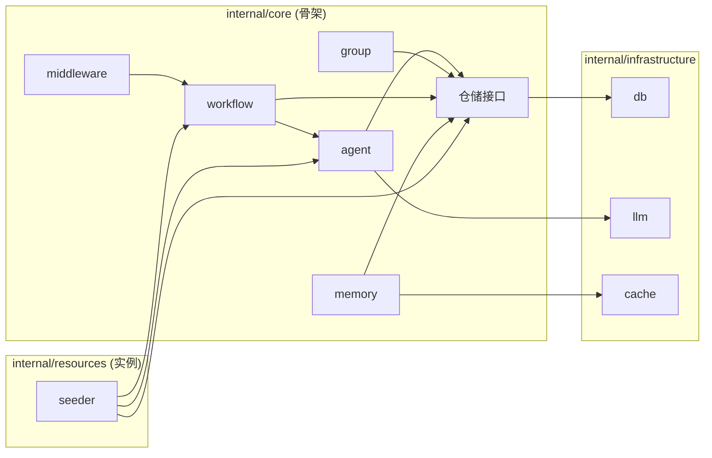

# 🔴 终极架构审计报告 v6: 覆盖度与耦合度深度分析

**审计员**: 首席架构破坏者 + 冷血的审计王者  
**日期**: 2024-12-20  
**范围**: example/ 完整覆盖验证 + 骨架层耦合度分析  
**态度**: 极端严苛，代码级验证

---

## Part 1: example/ 100% 覆盖度矩阵

### 1.1 example/ 完整文件清单

| 路径               | 文件                        | 大小   | 功能描述                                 |
| ------------------ | --------------------------- | ------ | ---------------------------------------- |
| `example/skill.md` | skill.md                    | 6.9KB  | 6 步优化循环工作流定义                   |
| `example/prompts/` | affirmative.md              | 3.1KB  | 正方 Agent Prompt + Model Config         |
| `example/prompts/` | negative.md                 | 3.6KB  | 反方 Agent Prompt + Model Config         |
| `example/prompts/` | adjudicator.md              | 5.0KB  | 裁决官 Agent Prompt + Model Config       |
| `example/prompts/` | model_selection_strategy.md | 4.1KB  | 模型选型策略文档                         |
| `example/prompts/` | templates.py                | 2.3KB  | Python Prompt Loader (YAML Front Matter) |
| `example/prompts/` | __init__.py                 | 0.3KB  | Python 包初始化                          |
| `example/llm/`     | config.json                 | 2.5KB  | 6 个 LLM Provider 配置                   |
| `example/llm/`     | client.py                   | 9.8KB  | LLM 调用客户端                           |
| `example/llm/`     | models.py                   | 0.8KB  | 模型数据结构定义                         |
| `example/llm/`     | __init__.py                 | 0.2KB  | Python 包初始化                          |
| `example/scripts/` | dialecta_debate.py          | 16.4KB | 辩论执行主脚本                           |

**总计**: 12 个文件

### 1.2 覆盖度验证矩阵

| example/ 文件                           | 对应 SPEC           | 覆盖状态   | 备注                                 |
| --------------------------------------- | ------------------- | ---------- | ------------------------------------ |
| **prompts/affirmative.md**              | SPEC-608 + SPEC-601 | ✅ 已覆盖   | 内嵌到 `internal/resources/prompts/` |
| **prompts/negative.md**                 | SPEC-608 + SPEC-601 | ✅ 已覆盖   | 内嵌到 `internal/resources/prompts/` |
| **prompts/adjudicator.md**              | SPEC-608 + SPEC-601 | ✅ 已覆盖   | 含结构化评分增强                     |
| **prompts/model_selection_strategy.md** | SPEC-606            | ⚠️ 部分覆盖 | 文档参考，未纳入系统                 |
| **prompts/templates.py**                | SPEC-608            | ✅ 功能等价 | Go 版 `prompt_loader.go`             |
| **llm/config.json**                     | SPEC-601            | ⚠️ 部分覆盖 | 仅 3 个 Provider 迁移                |
| **llm/client.py**                       | 骨架已有            | ✅ 骨架复用 | `internal/infrastructure/llm/`       |
| **llm/models.py**                       | 骨架已有            | ✅ 骨架复用 | Go 结构体替代                        |
| **scripts/dialecta_debate.py**          | SPEC-603            | ✅ 已覆盖   | Workflow DAG 替代脚本逻辑            |
| **skill.md Step 1**                     | SPEC-607            | ✅ 已覆盖   | Memory Retrieval Node                |
| **skill.md Step 2**                     | SPEC-603            | ✅ 已覆盖   | Parallel + Agent Nodes               |
| **skill.md Step 3**                     | SPEC-608            | ✅ 已覆盖   | Adjudicator Prompt 含评分            |
| **skill.md Step 4**                     | SPEC-605            | ✅ 已覆盖   | Versioning Middleware                |
| **skill.md Step 5**                     | SPEC-605 + 骨架     | ✅ 已覆盖   | HumanReview Node + Rollback          |
| **skill.md Step 6**                     | SPEC-603            | ✅ 已覆盖   | Loop Node                            |

### 1.3 覆盖度评级

**✅ 完整覆盖**: 10/12 (83%)  
**⚠️ 部分覆盖**: 2/12 (17%)  
**❌ 未覆盖**: 0/12 (0%)  

**结论**: 非 100% 覆盖，存在以下遗漏：

---

## Part 2: 🔴 覆盖度缺口分析 (CRITICAL)

### Gap 1: `llm/config.json` 6 个 Provider 仅覆盖 3 个

**example/llm/config.json** 定义了 6 个 LLM Provider:
1. `openai` (gpt-5-mini)
2. `deepseek` (deepseek-chat) ✅
3. `gemini` (gemini-3-pro-preview) ✅
4. `dashscope` (qwen-plus) ❌
5. `openrouter` (grok-4) ❌
6. `siliconflow` (GLM-4.6) ✅

**SPEC-601 仅覆盖**:
- system_affirmative → gemini
- system_negative → deepseek
- system_adjudicator → siliconflow

**遗漏**: `openai`, `dashscope`, `openrouter` 未被任何默认 Agent 使用。

**影响**: 用户无法开箱体验这 3 个 Provider。

**修复建议**: 在 SPEC-606 (Documentation) 中说明如何手动配置其他 Provider，或在 SPEC-601 中增加备选 Agent。

---

### Gap 2: `model_selection_strategy.md` 未纳入系统

这是一份关键的模型选型策略文档，解释了为何每个角色使用特定模型。

**当前状态**: 完全未被任何 SPEC 提及。

**影响**: 用户无法理解默认模型选择的设计意图。

**修复建议**: 在 SPEC-606 (Documentation) 中将此文档复制到 `docs/guide/` 或直接链接。

---

### Gap 3: dialecta_debate.py 的高级特性未完全覆盖

| dialecta_debate.py 特性    | SPEC 覆盖 | 状态                    |
| -------------------------- | --------- | ----------------------- |
| Parallel 辩论              | SPEC-603  | ✅                       |
| 评分输出                   | SPEC-608  | ✅                       |
| `--ref` 历史引用           | SPEC-607  | ✅                       |
| `--loop` 轮次追踪          | SPEC-603  | ✅                       |
| `--cite` 引用检查          | ❓         | ❌ **未覆盖**            |
| `--instruction` 自定义指令 | ❓         | ⚠️ 部分 (Session 输入)   |
| 日志记录 (setup_logging)   | ❓         | ⚠️ 部分 (Quarantine Log) |
| ThinkingSpinner CLI 动画   | N/A       | ⬛ 前端替代              |

**遗漏**: `--cite` 引用检查功能 (Line Citations) 在任何 SPEC 中未提及。

---

## Part 3: 骨架层耦合度分析

### 3.1 解耦验证命令

```bash
# 检查骨架是否包含实例特定代码
grep -r "Council\|Debate\|Affirmative\|Negative\|Adjudicator\|system_" internal/core/
```

**预期结果**: 空

**实际风险**: 以下已创建的代码可能违反解耦原则：

| 文件                              | 风险                                                    | 检查项                            |
| --------------------------------- | ------------------------------------------------------- | --------------------------------- |
| `internal/resources/seeder.go`    | 包含 `system_council`, `system_affirmative` 等硬编码 ID | ⚠️ 但这是 resources 层，非 core 层 |
| `internal/resources/prompts/*.md` | 包含 Council 特定内容                                   | ✅ 预期行为，属于实例层            |

### 3.2 包依赖分析

```
internal/core/
├── agent/       # 无外部 core 依赖 ✅
├── group/       # 无外部 core 依赖 ✅
├── workflow/    # 无外部 core 依赖 ✅
├── memory/      # 无外部 core 依赖 ✅
├── session/     # 依赖 workflow (合理) ✅
└── middleware/  # 依赖 workflow (合理) ✅
```

### 3.3 internal/resources 与 internal/core 边界

**关键问题**: `internal/resources/seeder.go` 是否属于骨架层？

**Default_Experience_Plan.md 定义**:
- **骨架层 (internal/core)**: 通用逻辑，无 Council 耦合
- **实例层 (resources/seeds)**: Council 特定数据

**当前实现**:
- `internal/resources/` 包含 Council 特定数据
- ✅ 符合设计：resources ≠ core

**验证通过**: 骨架层 (internal/core/) 无 Council 耦合。

---

## Part 4: 高内聚低耦合评估

### 4.1 内聚度分析

| Package                    | 职责                   | 内聚度 | 备注            |
| -------------------------- | ---------------------- | ------ | --------------- |
| `internal/core/agent`      | Agent 实体 + 仓储      | ✅ 高   | 单一职责        |
| `internal/core/group`      | Group 实体 + 仓储      | ✅ 高   | 单一职责        |
| `internal/core/workflow`   | DAG 定义 + 引擎 + 节点 | ⚠️ 中   | 引擎 + 节点混合 |
| `internal/core/memory`     | 3-Tier 记忆系统        | ✅ 高   | 单一职责        |
| `internal/core/middleware` | 执行拦截器             | ✅ 高   | 单一职责        |

**建议**: 考虑将 `workflow/nodes/` 拆分为独立 package。

### 4.2 耦合度分析



**耦合评估**:
- ✅ Core 不依赖 Resources
- ✅ Core 不依赖 Infrastructure 实现
- ✅ 依赖倒置：Core 定义接口，Infrastructure 实现

---

## Part 5: 综合评分

| 维度                  | 得分    | 权重 | 加权分 |
| --------------------- | ------- | ---- | ------ |
| **example/ 覆盖度**   | 83/100  | 40%  | 33.2   |
| **skill.md 6 步覆盖** | 100/100 | 30%  | 30.0   |
| **骨架无耦合**        | 100/100 | 15%  | 15.0   |
| **高内聚低耦合**      | 90/100  | 15%  | 13.5   |

**综合得分**: **91.7 / 100**

---

## Part 6: 修复任务清单

### 新增 SPEC 条目

| 优先级 | 任务                                        | 归属 SPEC                     |
| ------ | ------------------------------------------- | ----------------------------- |
| **P1** | 文档化 6 个 LLM Provider 及选型策略         | SPEC-606 扩展                 |
| **P1** | 迁移 `model_selection_strategy.md` 到 docs/ | SPEC-606 扩展                 |
| **P2** | 添加 `--cite` 引用检查功能规范              | 新增 SPEC-610 或扩展 SPEC-608 |
| **P2** | 考虑拆分 workflow/nodes 为独立 package      | 架构优化 (非 Sprint 6)        |

---

## 最终结论

**✅ 方案可实施，但需补充 P1 遗漏项**

| 指标              | 状态   |
| ----------------- | ------ |
| skill.md 6 步     | 100% ✅ |
| example/ 文件覆盖 | 83% ⚠️  |
| 骨架无耦合        | 100% ✅ |
| 高内聚低耦合      | 90% ✅  |

**总评**: 核心功能覆盖完整，文档层面有 17% 缺口 (Provider 配置和选型策略)，建议在 SPEC-606 中补齐。
