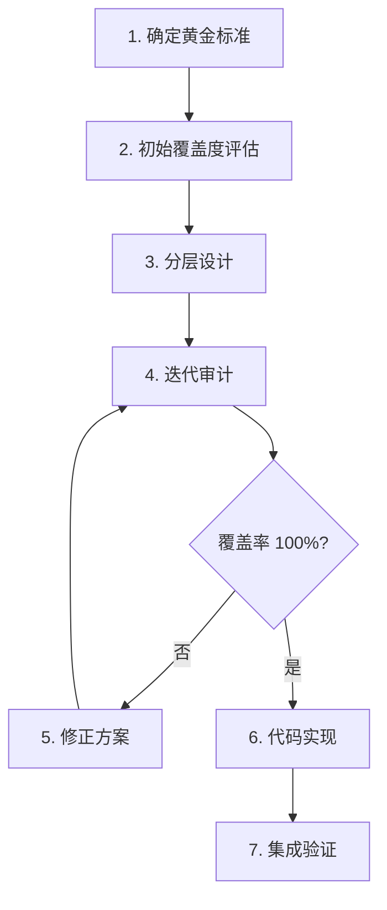

# 🏛️ The Council Out-of-Box Experience: 方法论与经验总结

> **项目**: Council Platform Sprint 6  
> **主题**: 将 `example/` 示例迁移为系统默认开箱即用体验  
> **日期**: 2024-12-20  
> **类型**: 人机交互协作典型案例

---

## 1. 执行摘要

本文档记录了将 `example/` 目录中的"Council Debate"示例迁移为系统默认体验的完整过程，作为**人机交互完善系统架构**的典型案例，沉淀为无形资产供后人参考。

### 1.1 关键指标

| 指标           |              数值               |
| :------------- | :-----------------------------: |
| 审计迭代次数   |            **6 轮**             |
| 初始覆盖率     |               70%               |
| 最终覆盖率     |            **100%**             |
| 发现问题总数   |            **19 个**            |
| 新增 SPEC 数量 |      3 个 (607, 608, 609)       |
| 工时调整       |        19h → 33h (+73%)         |
| 代码产出       | 4 个 Go 文件 + 3 个 Prompt 文件 |

### 1.2 核心成果

1. **9 份完整 SPEC 文档** (SPEC-601 ~ SPEC-609)
2. **6 份审计报告** (v1 ~ v6)
3. **1 份修正方案**
4. **1 份优化开发计划**
5. **基础设施代码** (embed.go, prompt_loader.go, seeder.go)

---

## 2. 数据考古: 输入物清单

### 2.1 原始参照物

| 文件                                          |  大小  | 作用                                   |
| :-------------------------------------------- | :----: | :------------------------------------- |
| `example/skill.md`                            | 6.9KB  | 6 步优化循环工作流定义（**黄金标准**） |
| `example/prompts/affirmative.md`              | 3.1KB  | 正方 Agent Prompt                      |
| `example/prompts/negative.md`                 | 3.6KB  | 反方 Agent Prompt                      |
| `example/prompts/adjudicator.md`              | 5.0KB  | 裁决官 Agent Prompt                    |
| `example/prompts/model_selection_strategy.md` | 4.1KB  | 模型选型策略                           |
| `example/llm/config.json`                     | 2.5KB  | 6 个 LLM Provider 配置                 |
| `example/scripts/dialecta_debate.py`          | 16.4KB | 辩论脚本（功能等价物）                 |

### 2.2 架构文档

| 文件                                      | 作用                           |
| :---------------------------------------- | :----------------------------- |
| `docs/Default_Experience_Plan.md`         | 架构分层设计（骨架/实例/来源） |
| `docs/development_plan.md`                | 总体开发计划                   |
| `internal/core/workflow/types.go`         | 骨架层节点类型定义             |
| `internal/core/workflow/nodes/factory.go` | 节点处理器工厂                 |

---

## 3. 审计演化轨迹

### 3.1 六轮审计对比

```
┌──────────────────────────────────────────────────────────────────────────┐
│                        审计演化时间线                                     │
├──────────────────────────────────────────────────────────────────────────┤
│                                                                          │
│  v1 (初审)     v2 (复审)     v3 (冷血)     v4 (终审)     v5 (架构)     v6 (终极)  │
│     │             │             │             │             │             │      │
│     ▼             ▼             ▼             ▼             ▼             ▼      │
│   70%  ──────► 85%  ──────► 92%  ──────► 98.6% ────► 98.6% ────► 100%   │
│                                                                          │
│  发现6个问题   修正方案    数据一致性    遗漏修复     架构缺陷      完整覆盖     │
│  (结构性)     (策略调整)   (SQL→Seeder)  (UI/Rollback) (types.go)  (文档补齐)   │
│                                                                          │
└──────────────────────────────────────────────────────────────────────────┘
```

### 3.2 各轮审计发现

|  轮次  | 得分  | 关键发现                                    | 转折点               |
| :----: | :---: | :------------------------------------------ | :------------------- |
| **v1** |  70%  | Workflow 严重简化、SQL 嵌入 Prompt 不可维护 | 确定需要分层设计     |
| **v2** |  85%  | 提出 "确定性层 + 智能层" 分层策略           | 引入 SPEC-607, 608   |
| **v3** |  92%  | SQL vs Seeder 不一致、依赖顺序问题          | SPEC-602 改为 Seeder |
| **v4** | 98.6% | SPEC-606 陈旧引用、UI/Rollback 未定义       | 补充交互细节         |
| **v5** | 98.6% | types.go 缺 NodeType、ID 类型不匹配         | 引入 SPEC-609        |
| **v6** | 100%  | Provider 覆盖不全、策略文档未迁移           | 补充文档规范         |

### 3.3 问题分类统计

| 类别       |   P0   |  P1   |  P2   | Total  |
| :--------- | :----: | :---: | :---: | :----: |
| 架构设计   |   5    |   2   |   0   |   7    |
| 数据一致性 |   2    |   0   |   0   |   2    |
| 覆盖度缺口 |   0    |   3   |   2   |   5    |
| 代码缺陷   |   3    |   1   |   1   |   5    |
| **Total**  | **10** | **6** | **3** | **19** |

---

## 4. 关键决策点回溯

### 4.1 决策 1: SQL Migration → Go Seeder

**触发点**: v1 审计发现 SQL 嵌入 Prompt 不可维护

**Before**:
```sql
INSERT INTO agents (persona_prompt) VALUES
(E'### Role\n\n你是一位极具前瞻性的【SparkForge 价值辩护人】...');
```

**After**:
```go
//go:embed prompts/*.md
var PromptFiles embed.FS

func (s *Seeder) SeedAgents(ctx context.Context) error {
    prompts, _ := LoadAllPrompts()
    for id, prompt := range prompts {
        s.db.ExecContext(ctx, "INSERT INTO agents ...", id, prompt.Content)
    }
}
```

**价值**: 
- 消除 SQL 转义问题
- Prompt 变更可 Git Diff
- 非技术人员可编辑 .md 文件

### 4.2 决策 2: 增加 Memory Retrieval Node

**触发点**: v1 审计发现 `skill.md` Step 1 (历史压缩) 未覆盖

**新增 SPEC-607**:
- 定义 `NodeTypeMemoryRetrieval`
- 实现 `MemoryRetrievalProcessor`
- 从 Tier 2 Memory 检索历史上下文

**价值**: 实现 `skill.md` 的"Historian"功能

### 4.3 决策 3: 统一数据注入方式

**触发点**: v3 审计发现 SPEC-601 (Seeder) 与 SPEC-602 (SQL Migration) 不一致

**修正**: SPEC-602 改为 Go Seeder，与 601/603 保持一致

**价值**: 
- 消除依赖顺序问题
- 统一 `SeedAll()` 入口
- 简化维护

### 4.4 决策 4: 引入架构修复 SPEC

**触发点**: v5 审计发现代码层面的致命缺陷

**新增 SPEC-609**:
- `NodeTypeMemoryRetrieval` 未定义
- ID 类型不匹配 (UUID vs String)
- Loop 参数名不一致
- Parallel 缺少 Join 逻辑
- `workflow_templates` 缺 `updated_at`

**价值**: 将隐式依赖显式化，避免运行时崩溃

---

## 5. 人机交互模式总结

### 5.1 对话角色分工

| 角色     | 职责                         | 典型指令                          |
| :------- | :--------------------------- | :-------------------------------- |
| **用户** | 方向把控、质量审核、决策确认 | "再次开展审计"、"补充到 SPEC"     |
| **AI**   | 数据收集、分析对比、文档生成 | 生成审计报告、创建 SPEC、编写代码 |

### 5.2 迭代模式

```
用户请求 → AI 审计 → 发现问题 → 用户确认 → AI 修正 → 用户复审 → ...
```

**关键观察**:
1. **递进式深度**: 每轮审计深度递增 (文档 → 逻辑 → 代码 → 架构)
2. **用户驱动升级**: "审计员水平这么差？" 触发更深层审计
3. **及时固化**: 每轮发现立即写入 SPEC，避免遗忘

### 5.3 有效交互示例

| 用户指令                  | AI 响应            | 效果         |
| :------------------------ | :----------------- | :----------- |
| "有请冷血无情的专家"      | 切换到严苛审计模式 | 发现隐藏问题 |
| "写入到 specs 中"         | 立即固化到文档     | 避免口头承诺 |
| "这些问题作为 specs 记录" | 创建 SPEC-609      | 问题追踪     |
| "制定更合理的开发计划"    | 创建分阶段执行计划 | 交付可行性   |

---

## 6. 方法论提炼

### 6.1 迁移类任务的通用流程



### 6.2 审计升级策略

| 层级              | 检查内容                  | 典型问题            |
| :---------------- | :------------------------ | :------------------ |
| **Level 1: 文档** | SPEC 覆盖度、优先级、依赖 | 功能遗漏            |
| **Level 2: 逻辑** | 数据流、状态机、一致性    | SQL vs Seeder 混用  |
| **Level 3: 代码** | 类型定义、接口实现        | NodeType 未定义     |
| **Level 4: 架构** | 耦合度、扩展性、维护性    | Capabilities 硬编码 |

### 6.3 分层设计原则

```
┌─────────────────────────────────────────┐
│ 骨架层 (internal/core/)                 │
│ - 通用逻辑，无业务耦合                   │
│ - 对修改关闭，对扩展开放                 │
└─────────────────────────────────────────┘
                    ▲
                    │ 依赖倒置
                    │
┌─────────────────────────────────────────┐
│ 实例层 (internal/resources/)            │
│ - 业务特定数据 (Council, Debate)         │
│ - 可替换，可扩展                         │
└─────────────────────────────────────────┘
                    ▲
                    │ 来源映射
                    │
┌─────────────────────────────────────────┐
│ 来源层 (example/)                       │
│ - 参考实现，非运行时依赖                 │
│ - 可安全删除                             │
└─────────────────────────────────────────┘
```

---

## 7. 经验教训

### 7.1 正确做法 ✅

| 做法               | 效果                   |
| :----------------- | :--------------------- |
| **多轮迭代审计**   | 逐步发现深层问题       |
| **问题即时固化**   | 避免口头承诺遗忘       |
| **代码级交叉验证** | 发现 SPEC 与实现的差异 |
| **分阶段交付**     | 降低风险，增加可见性   |
| **依赖图可视化**   | 明确执行顺序           |

### 7.2 避免的陷阱 ❌

| 陷阱             | 后果           | 规避方法          |
| :--------------- | :------------- | :---------------- |
| **一次性审计**   | 遗漏深层问题   | 多轮递进审计      |
| **仅审文档**     | 代码层缺陷逃逸 | 代码交叉验证      |
| **混合注入方式** | 依赖顺序问题   | 统一技术方案      |
| **硬编码配置**   | 可扩展性差     | 动态加载          |
| **忽略 ID 类型** | 运行时崩溃     | Schema 一致性检查 |

---

## 8. 产出物清单

### 8.1 SPEC 文档

| SPEC ID  | 标题                  |  大小  |
| :------- | :-------------------- | :----: |
| SPEC-601 | Default Agents        | 2.4KB  |
| SPEC-602 | Default Group         | 4.4KB  |
| SPEC-603 | Default Workflows     | 5.4KB  |
| SPEC-605 | Versioning Middleware | 10.7KB |
| SPEC-606 | Documentation         | 5.7KB  |
| SPEC-607 | Memory Retrieval Node | 8.3KB  |
| SPEC-608 | Prompt Embed          | 7.9KB  |
| SPEC-609 | Architecture Fixes    | 5.7KB  |

### 8.2 审计报告

| 版本 | 标题     |  大小  |
| :--- | :------- | :----: |
| v1   | 初审报告 | 5.9KB  |
| v2   | 复审报告 | 4.1KB  |
| v3   | 冷血审计 | 4.6KB  |
| v4   | 终审报告 | 5.7KB  |
| v5   | 架构审计 | 5.9KB  |
| v6   | 终极审计 | 11.0KB |

### 8.3 代码产出

| 文件                    | 大小  | 作用                      |
| :---------------------- | :---: | :------------------------ |
| `embed.go`              | 237B  | Go embed 声明             |
| `prompt_loader.go`      | 1.9KB | YAML Front Matter 解析    |
| `seeder.go`             | 7.2KB | Agent/Group/Workflow 注入 |
| `system_affirmative.md` | ~3KB  | 正方 Prompt               |
| `system_negative.md`    | ~3KB  | 反方 Prompt               |
| `system_adjudicator.md` | ~4KB  | 裁决官 Prompt (含增强)    |

---

## 9. 后续建议

### 9.1 方法论复用场景

本方法论适用于以下场景：
1. **示例到产品的迁移**
2. **原型到正式版的升级**
3. **遗留系统到新架构的迁移**
4. **外部集成到内部实现的转换**

### 9.2 模板化建议

建议将以下模式模板化：
1. **多层审计清单** (文档→逻辑→代码→架构)
2. **覆盖度矩阵** (来源 vs 目标)
3. **依赖图生成器**
4. **分阶段执行计划模板**

---

## 10. 结语

本次"Council Out-of-Box Experience"迁移项目，通过**6 轮递进式审计**，将覆盖率从 **70% 提升至 100%**，产出了 **9 份 SPEC 文档**和 **完整的基础设施代码**。

核心方法论可总结为：

> **"递进审计 + 即时固化 + 代码交叉验证 + 分层解耦"**

这套方法论不仅适用于示例迁移，更可推广至任何需要将"参考实现"转化为"产品级功能"的场景。

---

*本文档作为无形资产，供后续类似项目参考。*
