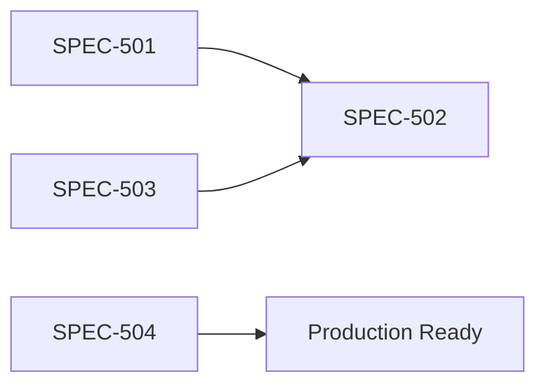

# Sprint 5: Post-MVP Optimization

> **目标**: 提升系统稳定性、国际化支持及安全性，为 1.0 正式版做准备。

## Specs 目录

| Spec ID  | 文档                                               | 类型     | 优先级 | 状态     |
| :------- | :------------------------------------------------- | :------- | :----- | :------- |
| SPEC-501 | [i18n 国际化](./SPEC-501-i18n.md)                  | Feature  | **P0** | [ ] Todo |
| SPEC-502 | [E2E 测试](./SPEC-502-e2e-testing.md)              | QA       | P1     | [ ] Todo |
| SPEC-503 | [性能优化](./SPEC-503-performance-optimization.md) | Refactor | P2     | [ ] Todo |
| SPEC-504 | [安全强化](./SPEC-504-security-hardening.md)       | Security | P1     | [ ] Todo |

## 验收标准 (Sprint Level)

- [ ] 支持 EN/ZH 两种语言切换
- [ ] E2E 测试覆盖核心工作流 (≥5 个场景)
- [ ] 首屏加载时间 < 2s (P90)
- [ ] API 支持 Rate Limiting 和基础 RBAC

## 依赖关系

## 预估工期

| 任务     | 预估              |
| :------- | :---------------- |
| SPEC-501 | 8h                |
| SPEC-502 | 12h               |
| SPEC-503 | 6h                |
| SPEC-504 | 8h                |
| **总计** | **34h (~1 week)** |
