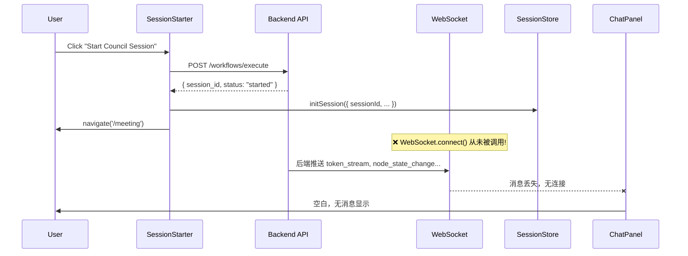

# SPEC-703: Session Startup WebSocket Connection Fix

## 1. Problem Statement

### 症状
用户在 `/meeting` 页面通过 `SessionStarter` 选择模板、输入主题并点击 "Start Council Session" 后：
1. API 调用成功 (`POST /api/v1/workflows/execute` 返回 202)
2. 页面导航到 `/meeting`
3. **但 ChatPanel 没有任何消息显示**，Meeting 无法正常进行

### 根因分析 (Root Cause)

**核心问题**: `SessionStarter.tsx` 在成功调用 API 后，**仅调用 `initSession()` 初始化本地状态，但从未调用 `useConnectStore.connect()` 建立 WebSocket 连接**。



**受影响代码**:
- `frontend/src/features/meeting/SessionStarter.tsx`: L63-75

```typescript
// 当前代码 (有缺陷)
initSession({
    sessionId: data.session_id,  // ✅ 初始化状态
    workflowId: template.id,
    groupId: 'default',
    nodes: nodes
});

onStarted(); // Close modal
navigate('/meeting');  // ✅ 导航

// ❌ 缺失: useConnectStore.getState().connect(wsUrl)
```

## 2. Solution Design

### 2.1 修复方案

在 `initSession` 后，立即调用 `useConnectStore.connect()` 建立 WebSocket 连接：

```typescript
// 修复后的代码
import { useConnectStore } from '../../stores/useConnectStore';

// 在 handleStart 成功分支:
initSession({
    sessionId: data.session_id,
    workflowId: template.id,
    groupId: 'default',
    nodes: nodes
});

// 🔧 FIX: 建立 WebSocket 连接
const wsUrl = `ws://${window.location.host}/api/v1/ws`;
useConnectStore.getState().connect(wsUrl);

onStarted();
navigate('/meeting');
```

### 2.2 Connection Lifecycle 优化

考虑到用户可能刷新页面或从其他入口进入 `/meeting`，需要在 `MeetingRoom.tsx` 增加连接状态检查：

```typescript
// MeetingRoom.tsx
useEffect(() => {
    const { status, connect } = useConnectStore.getState();
    if (currentSession && status === 'disconnected') {
        const wsUrl = `ws://${window.location.host}/api/v1/ws`;
        connect(wsUrl);
    }
}, [currentSession]);
```

## 3. Implementation Plan

### 3.1 Files to Modify

| File                                                              | Change                                         |
| ----------------------------------------------------------------- | ---------------------------------------------- |
| `frontend/src/features/meeting/SessionStarter.tsx`                | 添加 `useConnectStore` 导入和 `connect()` 调用 |
| `frontend/src/features/meeting/MeetingRoom.tsx`                   | 添加连接状态恢复逻辑                           |
| `frontend/src/features/meeting/__tests__/SessionStarter.test.tsx` | 更新测试，验证 `connect` 被调用                |

### 3.2 Detailed Changes

#### 3.2.1 SessionStarter.tsx

```diff
 import { useTemplates } from '../../hooks/useTemplates';
 import { useSessionStore } from '../../stores/useSessionStore';
+import { useConnectStore } from '../../stores/useConnectStore';

 ...

             initSession({
                 sessionId: data.session_id,
                 workflowId: template.id,
                 groupId: 'default',
                 nodes: nodes
             });

+            // Establish WebSocket connection
+            const wsHost = window.location.host;
+            const wsProtocol = window.location.protocol === 'https:' ? 'wss:' : 'ws:';
+            const wsUrl = `${wsProtocol}//${wsHost}/api/v1/ws`;
+            useConnectStore.getState().connect(wsUrl);

             onStarted();
             navigate('/meeting');
```

#### 3.2.2 MeetingRoom.tsx

```diff
 import { useSessionStore } from '../../stores/useSessionStore';
+import { useConnectStore } from '../../stores/useConnectStore';
+import { useEffect } from 'react';

 export const MeetingRoom: FC = () => {
     useWebSocketRouter();
     useFullscreenShortcuts();
+    
+    const currentSession = useSessionStore(state => state.currentSession);
+    const wsStatus = useConnectStore(state => state.status);
+    const connect = useConnectStore(state => state.connect);
+
+    // Auto-connect if session exists but WS is disconnected
+    useEffect(() => {
+        if (currentSession && wsStatus === 'disconnected') {
+            const wsHost = window.location.host;
+            const wsProtocol = window.location.protocol === 'https:' ? 'wss:' : 'ws:';
+            const wsUrl = `${wsProtocol}//${wsHost}/api/v1/ws`;
+            connect(wsUrl);
+        }
+    }, [currentSession, wsStatus, connect]);
```

## 4. Acceptance Criteria

- [x] 用户点击 "Start Council Session" 后，WebSocket 连接自动建立
- [x] ChatPanel 开始显示后端推送的消息 (token_stream 事件)
- [x] 刷新页面后，如果本地仍有 session 状态，WS 自动重连
- [x] 单元测试覆盖 `connect()` 调用

## 5. Testing Plan

### 5.1 Unit Tests
```typescript
// SessionStarter.test.tsx
it('should connect to WebSocket after successful API call', async () => {
    const mockConnect = vi.fn();
    useConnectStore.setState({ connect: mockConnect });
    
    // ... trigger handleStart ...
    
    expect(mockConnect).toHaveBeenCalledWith(expect.stringMatching(/ws.*\/api\/v1\/ws/));
});
```

### 5.2 Manual Verification
1. 启动 `npm run dev` 和后端 `go run ./cmd/council`
2. 进入 `/meeting` 页面
3. 选择 "Council Debate" 模板
4. 输入主题并点击 "Start Council Session"
5. **验证**: ChatPanel 应开始显示消息流

## 6. Risk Assessment

| Risk                               | Mitigation                                                            |
| ---------------------------------- | --------------------------------------------------------------------- |
| WebSocket URL 在不同环境下可能不同 | 使用 `window.location` 动态构建                                       |
| 页面刷新后 session 状态丢失        | 建议后续考虑持久化 session 到 localStorage (超出本 bugfix 范围)       |
| 重复连接导致资源泄漏               | `useConnectStore.connect()` 内部已有防护 (`readyState === OPEN` 检查) |
