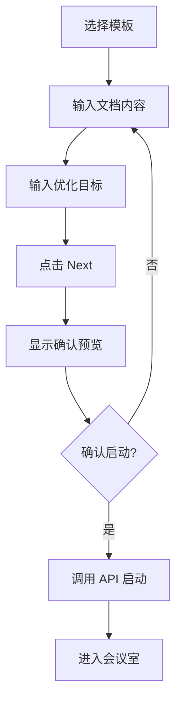

# SPEC-801: Session Startup Flow

## 元信息

| 属性     | 值       |
| :------- | :------- |
| Spec ID  | SPEC-801 |
| 类型     | Feature  |
| 优先级   | P0       |
| 预估工时 | 4h       |
| 依赖     | 无       |

## 背景

当前 `SessionStarter` 组件仅支持选择模板和输入主题，启动后工作流立即自动执行。这不符合 `example/skill.md` 中定义的人机协作流程，用户需要：
1. 上传/粘贴待审议文档
2. 输入优化目标
3. 确认启动前预览

## 目标

重构 Session 启动流程，提供完整的用户输入和确认环节。

## 技术方案

### 1. 前端修改

#### SessionStarter.tsx

**新增功能**：

```tsx
// 新增状态
const [documentContent, setDocumentContent] = useState('');
const [objective, setObjective] = useState('');
const [step, setStep] = useState<'input' | 'confirm'>('input');

// 新增 UI 区域
<div className="space-y-4">
  {/* 文档输入区 */}
  <FileUploadZone 
    onContentChange={setDocumentContent}
    accept={['.md', '.txt']}
  />
  
  {/* 优化目标 */}
  <textarea 
    placeholder="输入优化目标..."
    value={objective}
    onChange={e => setObjective(e.target.value)}
  />
  
  {/* 确认预览 */}
  {step === 'confirm' && (
    <ConfirmPreview 
      template={selectedTemplate}
      documentContent={documentContent}
      objective={objective}
    />
  )}
</div>
```

#### FileUploadZone.tsx (新建)

```
frontend/src/components/common/FileUploadZone.tsx
```

- 支持拖拽上传 + 粘贴
- 支持 .md, .txt 格式
- 显示文档预览

### 2. 后端修改

#### ExecuteRequest 扩展

```go
type ExecuteRequest struct {
    Graph    *workflow.GraphDefinition `json:"graph"`
    Input    map[string]interface{}    `json:"input"`
}

// input 中新增字段:
// - document_content: 待审议文档内容
// - optimization_objective: 优化目标
```

### 3. 交互流程



## 验收标准

- [ ] 用户可拖拽上传 .md/.txt 文件
- [ ] 用户可直接粘贴文档内容
- [ ] 用户可输入优化目标
- [ ] 点击 Next 显示确认预览
- [ ] 预览包含：模板名称、Agent 列表、文档摘要
- [ ] 确认后成功启动会话
- [ ] 文档内容和目标正确传递到后端

## 文件清单

| 操作     | 文件路径                                            |
| :------- | :-------------------------------------------------- |
| [MODIFY] | `frontend/src/features/meeting/SessionStarter.tsx`  |
| [NEW]    | `frontend/src/components/common/FileUploadZone.tsx` |
| [NEW]    | `frontend/src/features/meeting/ConfirmPreview.tsx`  |
| [MODIFY] | `internal/api/handler/workflow.go`                  |
