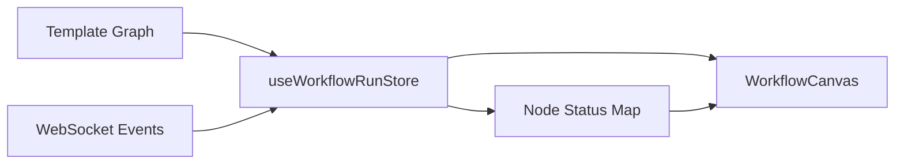

# SPEC-802: Workflow Live Monitor

## 元信息

| 属性     | 值       |
| :------- | :------- |
| Spec ID  | SPEC-802 |
| 类型     | Feature  |
| 优先级   | P1       |
| 预估工时 | 3h       |
| 依赖     | SPEC-801 |

## 背景

当前会议室左侧工作流画布在运行时为空白，用户无法直观了解当前执行进度。

## 目标

在运行模式下显示工作流图，实时高亮当前执行节点。

## 技术方案

### 1. 数据流



### 2. 前端修改

#### useWorkflowRunStore.ts

```ts
interface WorkflowRunState {
    // 新增
    graphDefinition: GraphDefinition | null;
    
    // 新增 action
    setGraphFromTemplate: (template: Template) => void;
}
```

#### WorkflowCanvas.tsx

```tsx
interface WorkflowCanvasProps {
    // 新增
    mode?: 'edit' | 'run';
    graphDefinition?: GraphDefinition;
}

// 运行模式下
if (mode === 'run') {
    // 禁用拖拽
    // 根据 nodeStatus 设置节点样式
    // 当前运行节点添加脉冲动画
}
```

#### MeetingRoom.tsx

```tsx
// 传递 graph 到 WorkflowCanvas
<WorkflowCanvas 
    mode="run"
    graphDefinition={workflowRunStore.graphDefinition}
/>
```

### 3. 节点状态样式

| 状态      | 样式                |
| :-------- | :------------------ |
| pending   | 灰色边框            |
| running   | 蓝色边框 + 脉冲动画 |
| completed | 绿色边框 + 勾号图标 |
| failed    | 红色边框 + 叉号图标 |

### 4. 脉冲动画 CSS

```css
@keyframes pulse-ring {
    0% { box-shadow: 0 0 0 0 rgba(59, 130, 246, 0.4); }
    70% { box-shadow: 0 0 0 10px rgba(59, 130, 246, 0); }
    100% { box-shadow: 0 0 0 0 rgba(59, 130, 246, 0); }
}

.node-running {
    animation: pulse-ring 1.5s infinite;
}
```

## 验收标准

- [ ] 会话启动后左侧画布显示工作流节点
- [ ] 节点位置和连线与编辑器预览一致
- [ ] 当前执行节点显示脉冲动画
- [ ] 完成的节点显示绿色勾号
- [ ] 失败的节点显示红色叉号
- [ ] 运行模式下禁用拖拽编辑

## 文件清单

| 操作     | 文件路径                                              |
| :------- | :---------------------------------------------------- |
| [MODIFY] | `frontend/src/stores/useWorkflowRunStore.ts`          |
| [MODIFY] | `frontend/src/components/workflow/WorkflowCanvas.tsx` |
| [MODIFY] | `frontend/src/features/meeting/MeetingRoom.tsx`       |
| [MODIFY] | `frontend/src/index.css` (添加动画)                   |
