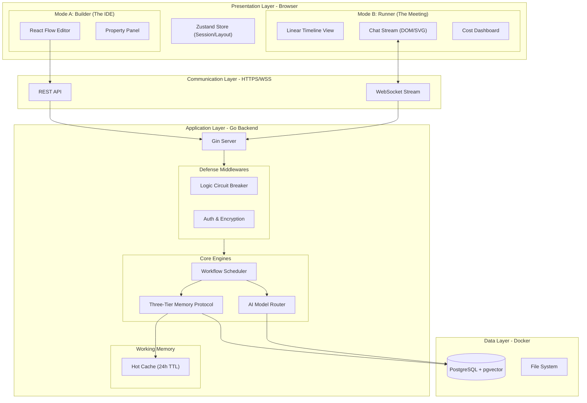

# 1. 总体架构设计 (High-Level Architecture)

采用 **"模式分离 (Mode Separation)"** 与 **"重后端"** 策略。前端负责两种互斥视图的渲染，后端负责全生命周期的核心逻辑与防御机制。

### 关键组件职责更新

1.  **双模前端 (Dual-Mode Frontend)**:
    *   **Builder**: 重型 WebGL 画布，加载完整 React Flow 库。
    *   **Runner**: 轻量级 DOM 渲染，卸载 Canvas 逻辑以优化长对话性能。

2.  **防御性中间件 (Defense Middlewares)**:
    *   **Logic Circuit Breaker**: 在进入 Workflow Engine 前拦截异常流量（死循环/Token 激增）。

3.  **三层记忆架构**:
    *   引入 **Redis** 作为第2层工作记忆 (Working Memory) 的存储介质。
