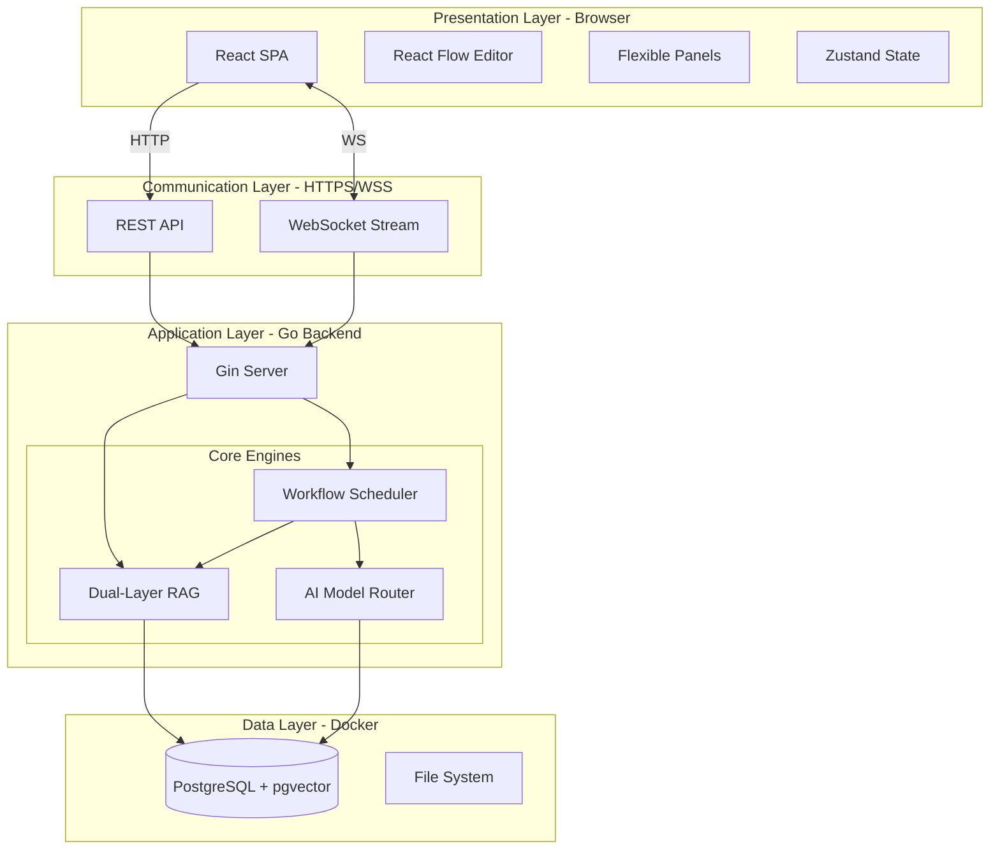

# 1. 总体架构设计 (High-Level Architecture)

采用 **"重后端，轻前端"** 的策略。React SPA 仅作为渲染层和交互外壳，所有的业务逻辑、流程调度、AI 交互、数据库管理均由 Go Backend API 承担。

```mermaid
graph TD
    subgraph Browser["Presentation Layer - Browser"]
        UI_Main["React SPA"]
        UI_Canvas["React Flow Editor"]
        UI_Layout["Flexible Panels"]
        Store["Zustand State"]
    end

    subgraph Communication["Communication Layer - HTTPS/WSS"]
        API_HTTP["REST API"]
        API_WS["WebSocket Stream"]
    end

    subgraph Backend["Application Layer - Go Backend"]
        Gateway["Gin Server"]
        
        subgraph Engines["Core Engines"]
            WorkflowEngine["Workflow Scheduler"]
            AIGateway["AI Model Router"]
            MemoryManager["Dual-Layer RAG"]
        end
    end

    subgraph Data["Data Layer - Docker"]
        DB[("PostgreSQL + pgvector")]
        FileSys["File System"]
    end

    UI_Main -->|HTTP| API_HTTP
    UI_Main <-->|WS| API_WS
    API_HTTP --> Gateway
    API_WS --> Gateway
    
    Gateway --> WorkflowEngine
    Gateway --> MemoryManager
    
    WorkflowEngine --> AIGateway
    WorkflowEngine --> MemoryManager
    
    MemoryManager --> DB
    AIGateway --> DB
```
