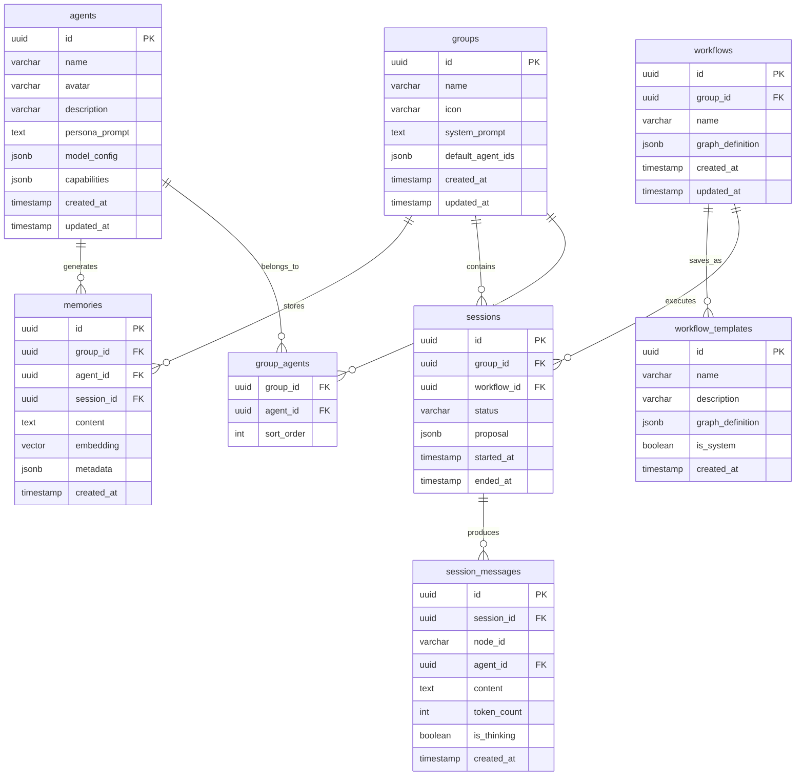

# 4. 数据存储架构 (Storage)

### 4.1 数据库选型与部署

考虑到"Local-First"和"私有化"，我们有两种方案，建议 MVP 采用方案 A：

* **方案 A (Pro/Dev)**: 依赖 Docker。用户需安装 Docker，App 启动时自动拉取并运行 `postgres:15-alpine` 镜像（带 pgvector）。
* **方案 B (Consumer)**: **Embedded Postgres**。使用 Go 库（如 `fergusstrange/embedded-postgres`）将 Postgres 二进制文件打包在应用中，解压即运行。**推荐 MVP 后期优化使用此方案，降低用户门槛。**

### 4.2 目录结构 (File System)

```text
council/
├── config.yaml          // 全局配置 (API Keys, 端口)
├── data/                // Embedded Postgres 数据目录
├── files/               // 用户上传的 PDF/MD 源文件
│   ├── group_A/
│   └── group_B/
├── logs/                // 运行日志
```

### 4.3 数据库 Schema (ER Diagram)

完整的表结构设计，覆盖 PRD 所有核心实体。



**SQL 迁移脚本示例 (`001_init_schema.up.sql`)：**

```sql
-- 启用 pgvector 扩展
CREATE EXTENSION IF NOT EXISTS vector;

-- 群组表
CREATE TABLE groups (
    id UUID PRIMARY KEY DEFAULT gen_random_uuid(),
    name VARCHAR(128) NOT NULL,
    icon VARCHAR(256),
    system_prompt TEXT,
    default_agent_ids JSONB DEFAULT '[]',
    created_at TIMESTAMPTZ DEFAULT NOW(),
    updated_at TIMESTAMPTZ DEFAULT NOW()
);

-- Agent 表
CREATE TABLE agents (
    id UUID PRIMARY KEY DEFAULT gen_random_uuid(),
    name VARCHAR(64) NOT NULL,
    avatar VARCHAR(256),
    description VARCHAR(512),
    persona_prompt TEXT NOT NULL,
    model_config JSONB NOT NULL DEFAULT '{"provider": "openai", "model": "gpt-4o", "temperature": 0.7}',
    capabilities JSONB DEFAULT '{"web_search": true, "search_provider": "tavily", "code_execution": false}',
    created_at TIMESTAMPTZ DEFAULT NOW(),
    updated_at TIMESTAMPTZ DEFAULT NOW()
);

-- 群组-Agent 关联表
CREATE TABLE group_agents (
    group_id UUID REFERENCES groups(id) ON DELETE CASCADE,
    agent_id UUID REFERENCES agents(id) ON DELETE CASCADE,
    sort_order INT DEFAULT 0,
    PRIMARY KEY (group_id, agent_id)
);

-- 工作流表
CREATE TABLE workflows (
    id UUID PRIMARY KEY DEFAULT gen_random_uuid(),
    group_id UUID REFERENCES groups(id) ON DELETE CASCADE,
    name VARCHAR(128) NOT NULL,
    graph_definition JSONB NOT NULL,
    created_at TIMESTAMPTZ DEFAULT NOW(),
    updated_at TIMESTAMPTZ DEFAULT NOW()
);

-- 工作流模板表
CREATE TABLE workflow_templates (
    id UUID PRIMARY KEY DEFAULT gen_random_uuid(),
    name VARCHAR(128) NOT NULL,
    description VARCHAR(512),
    graph_definition JSONB NOT NULL,
    is_system BOOLEAN DEFAULT FALSE,
    created_at TIMESTAMPTZ DEFAULT NOW()
);

-- 会议表
CREATE TABLE sessions (
    id UUID PRIMARY KEY DEFAULT gen_random_uuid(),
    group_id UUID REFERENCES groups(id) ON DELETE CASCADE,
    workflow_id UUID REFERENCES workflows(id),
    status VARCHAR(32) DEFAULT 'pending', -- pending, running, paused, completed, error
    proposal JSONB, -- {text: string, files: string[]}
    started_at TIMESTAMPTZ,
    ended_at TIMESTAMPTZ
);

-- 会议消息表
CREATE TABLE session_messages (
    id UUID PRIMARY KEY DEFAULT gen_random_uuid(),
    session_id UUID REFERENCES sessions(id) ON DELETE CASCADE,
    node_id VARCHAR(64) NOT NULL,
    agent_id UUID REFERENCES agents(id),
    content TEXT NOT NULL,
    token_count INT DEFAULT 0,
    is_thinking BOOLEAN DEFAULT FALSE,
    created_at TIMESTAMPTZ DEFAULT NOW()
);
CREATE INDEX idx_session_messages_session ON session_messages(session_id);

-- 记忆表 (向量存储)
CREATE TABLE memories (
    id UUID PRIMARY KEY DEFAULT gen_random_uuid(),
    group_id UUID REFERENCES groups(id) ON DELETE CASCADE,
    agent_id UUID REFERENCES agents(id), -- NULL 表示群记忆
    session_id UUID REFERENCES sessions(id),
    content TEXT NOT NULL,
    embedding VECTOR(1536), -- 1536 dim for text-embedding-ada-002
    metadata JSONB DEFAULT '{}',
    created_at TIMESTAMPTZ DEFAULT NOW()
);
CREATE INDEX idx_memories_group ON memories(group_id);
CREATE INDEX idx_memories_embedding ON memories USING ivfflat (embedding vector_cosine_ops) WITH (lists = 100);
```
